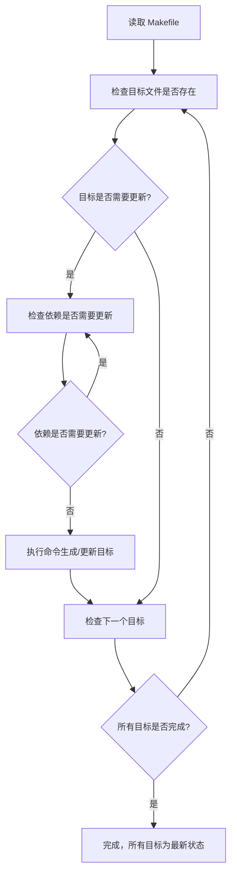
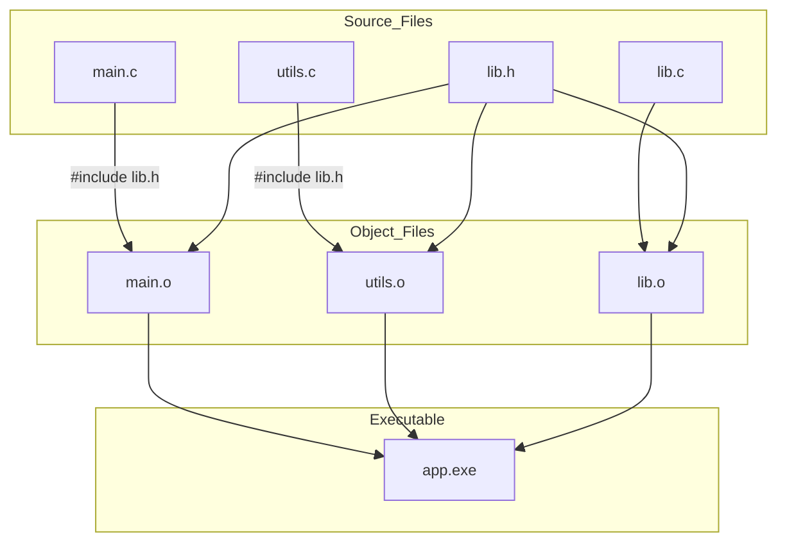

# make_note_1

make学习笔记，主要参考《跟我一起写makefile》学习。

实验平台：`6.6.87.2-microsoft-standard-WSL2`  `x86_64 GNU/Linux`   `GNU Make 4.3 `

~~~(空)
 uname -a
Linux DESKTOP-WANGS7 6.6.87.2-microsoft-standard-WSL2 #1 SMP PREEMPT_DYNAMIC Thu Jun  5 18:30:46 UTC 2025 x86_64 x86_64 x86_64 GNU/Linux

wangs7_ubuntu22@DESKTOP-WANGS7:~$ make -v
GNU Make 4.3
Built for x86_64-pc-linux-gnu
Copyright (C) 1988-2020 Free Software Foundation, Inc.
License GPLv3+: GNU GPL version 3 or later <http://gnu.org/licenses/gpl.html>
This is free software: you are free to change and redistribute it.
There is NO WARRANTY, to the extent permitted by law.
~~~

案例代码链接：https://github.com/s7wang/code_Notes2/tree/main/make_code

## 1 make 简介

不做过多概念介绍，只简单说明make的作用和工作原理

### 1.1 make的作用

**自动编译程序**：根据源代码和依赖关系，生成可执行文件或库。

**管理依赖关系**：只重新编译修改过的文件，避免全量编译，提高效率。

**执行批量命令**：可以用一条命令执行一系列复杂操作，比如清理、安装、打包。

**构建不同版本**：通过不同的目标（target），生成调试版、发布版、交叉编译版等。

**安装和部署**：可以自动将编译好的程序安装到指定目录。

**自动化测试**：可以定义测试目标，运行单元测试或集成测试。

**生成文档或资源文件**：比如把 markdown、图片、配置文件等生成最终文档或资源包。

**项目清理**：比如 `make clean` 删除临时文件和中间编译产物。

### 1.2 make的作用 

`make` 的工作原理可以直接用流程说明：

1. **读取 Makefile**：获取规则、目标、依赖和命令。
2. **检查目标文件是否存在**：如果目标不存在或依赖比目标新，则需要更新。
3. **递归检查依赖**：依赖本身可能也是目标，先处理依赖的更新。
4. **执行命令**：根据规则执行命令生成或更新目标文件。
5. **重复直到所有目标更新完**：按依赖顺序执行，确保最终所有目标都是最新状态。

可以总结一句：**按规则检查依赖、判断是否需要更新、然后执行命令**。

简单理解：整个过程就是一个**先自上而下检索，检索后自下向上构建的过程**。



这张图展示了 `make` 的核心流程：

- 先读 Makefile;
- 检查目标是否需要更新;
- 递归处理依赖;
- 执行命令;
- 循环直到所有目标更新完毕;

例如：



这个图说明了：

- 每个源文件（`.c`）会编译成对应的目标文件（`.o`）;
- 目标文件依赖头文件（`.h`）;
- 所有目标文件链接生成最终可执行文件.

### 1.3 make 的基本使用规范

1. makefile的命名

> make会在当前目录下找名字叫“Makefile”或“makefile”的文件。优先推荐Makefile。

2. make的基本语法规则

 ```makefile
target ... : prerequisites ...
 command
 ...
 ...
 # This is a code comment.
 ```

> * target 也就是一个目标文件，可以是Object File，也可以是执行文件。还可以是一个标签（Label），对于标签这种特性，在后续的“伪目标”章节中会有叙述。
> * prerequisites 就是，要生成那个target所需要的文件或是目标。
> * command也就是make需要执行的命令。（任意的Shell命令）
> * 代码注释以`#`“井号”开头

其中`:`“冒号”两侧要留空格，`command`要求必须以`Tab`开通或在`target`同行的末尾处用`;`“分号”与前部分隔开

## 2 Makefile 的书写规则

规则包含两个部分，一个是依赖关系，一个是生成目标的方法。

在Makefile中，规则的顺序是很重要的，因为，Makefile中只应该有一个最终目标，其它的目标都是被这个目标所连带出来的，所以一定要让make知道你的最终目标是什么。一般来说，定义在Makefile中的目标可能会有很多，但是第一条规则中的目标将被确立为最终的目标。如果第一条规则中的目标有很多个，那么，第一个目标会成为最终的目标。make所完成的也就是这个目标。好了，还是让我们来看一看如何书写规则。

### 2.1 规则的语法

~~~makefile
targets : prerequisites
command
...
# 或是这样：
targets : prerequisites ; command
command
...
~~~

* targets是文件名，以空格分开，可以使用通配符。一般来说，我们的目标基本上是一个文件，但也有可能是多个文件。
* command是命令行，如果其不与“target:prerequisites”在一行，那么，必须以[Tab键]开头，如果
* prerequisites在一行，那么可以用分号做为分隔。（见上）
* prerequisites也就是目标所依赖的文件（或依赖目标）。如果其中的某个文件要比目标文件要新，那么，目标就被认为是“过时的”，被认为是需要重生成的。这个在前面已经讲过了。

如果命令太长，你可以使用反斜框（‘\’）作为换行符。make对一行上有多少个字符没有限制。规则告诉make两件事，文件的依赖关系和如何成成目标文件。一般来说，make会以UNIX的标准Shell，也就是/bin/sh来执行命令。

#### example 2.1.1

目录结构：

`````
./
├── Makefile
├── makefile.example1
├── readme_make.md
└── src
    ├── defs.h
    ├── foo.c
    └── mian.c
`````

makefile.example1

```makefile
# filename: makefile.example1
src/foo.o : src/foo.c src/defs.h 
	cc -c -g -o src/foo.o src/foo.c

clean:
	rm -rf src/*.o
# 直接执行 make -f makefile.example1 进行编译
# 或执行 make -f makefile.example1 clean清除编译结果

#或通过统一的编译文件直接执行make example1 和 make example1-clean
```


### 2.2 规则中的通配符

如果我们想定义一系列比较类似的文件，我们很自然地就想起使用通配符。make支持三各通配符：“`*`”，“`?`”和“`[...]`”。这是和Unix的B-Shell是相同的。通配符代替了你一系列的文件，如“`*.c`”表示所以后缀为c的文件。一个需要我们注意的是，如果我们的文件名中有通配符，如：“`*`”，那么可以用转义字符“`\`”，如“`\*`”来表示。真实的“`*`”字符，而不是任意长度的字符串。当然有一些其他的“通配符”如`%` `@` 等，实际上这些不是通配符，而是被叫做模式匹配符（`%`）和自动变量（`$@`  `$<` `$^` `$?`）。这里可以简单说明后续做详细说明。

| 通配符  | 含义                     |
| ------- | ------------------------ |
| `*`     | 匹配任意长度字符（含空） |
| `?`     | 匹配任意单个字符         |
| `[...]` | 匹配字符集内的任意字符   |

````makefile
SRC = src/*.c        # 匹配 src 下所有 .c 文件
OBJ = build/*.o      # 匹配 build 下所有 .o 文件
FILES = data/file?.txt  # 匹配 file1.txt file2.txt ...
SPEC = [abc].txt     # 匹配 a.txt / b.txt / c.txt
````

模式规则 **使用 `%`**——这是 make 的特别符号，不同于 shell 通配符。

| 符号 | 含义                                     |
| ---- | ---------------------------------------- |
| `%`  | 表示任意部分（匹配文件名中相同的“stem”） |

Make 自动变量（在通配规则中使用）

| 自动变量 | 含义                     |
| -------- | ------------------------ |
| `$@`     | 规则的目标文件           |
| `$<`     | 第一个依赖文件           |
| `$^`     | 所有依赖文件（去重）     |
| `$?`     | 所有比目标“新”的依赖文件 |

下面是通配符的使用例子

#### example 2.2.1

~~~makefile
# filename: makefile.example2
all: src/print src/print2 src/print3

src/print: src/*.c
	@echo $? | tee $@

src/print2: src/foo?.c
	@echo $? | tee $@

# 定义依赖文件变量
SRC3 := $(wildcard src/[abcdefos][abcdefos][abcdefos].c) \
        $(wildcard src/[abcdefos][abcdefos][abcdefos][abcdefos].h)
# 规则
src/print3: $(SRC3) src/[main][main][main][mian].c
	@echo $^ | tee $@

clean:
	rm -rf src/print*
# 直接执行 make -f makefile.example2 进行编译
# 或执行 make -f makefile.example2 clean清除编译结果

#或通过统一的编译文件直接执行make example1 和 make example2-clean
~~~

输出结果：

~~~
shell@user$ make example2
make -f makefile.example2
make[1]: Entering directory 'xxx'
src/foo.c src/foo1.c src/foo2.c src/main.c
src/foo1.c src/foo2.c
src/foo.c src/defs.h src/main.c
make[1]: Leaving directory 'xxx'
~~~


### 2.3 文件搜索

在一些大的工程中，有大量的源文件，我们通常的做法是把这许多的源文件分类，并存放在不同的目录中。所以，当make需要去找寻文件的依赖关系时，你可以在文件前加上路径，但最好的方法是把一个路径告诉make，让make在自动去找。

Makefile文件中的特殊变量“VPATH”就是完成这个功能的，如果没有指明这个变量，make只会在当前的目录中去找寻依赖文件和目标文件。如果定义了这个变量，那么，make就会在当当前目录找不到的情况下，到所指定的目录中去找寻文件了。

~~~makefile
VPATH = src:../headers
~~~

上面的的定义指定两个目录，“src”和“../headers”，make会按照这个顺序进行搜索。目录由“冒号”分隔。（当然，当前目录永远是最高优先搜索的地方）

另一个设置文件搜索路径的方法是使用make的“vpath”关键字（注意，它是全小写的），这不是变量，这是一个make的关键字，这和上面提到的那个VPATH变量很类似，但是它更为灵活。它可以指定不同的文件在不同的搜索目录中。这是一个很灵活的功能。它的使用方法有三种：

~~~makefile
# 1、为符合模式<pattern>的文件指定搜索目录<directories>。
vpath <pattern> <directories>

# 2、清除符合模式<pattern>的文件的搜索目录。
vpath <pattern>

# 3、清除所有已被设置好了的文件搜索目录。
vpath
~~~

vapth使用方法中的\<pattern\>需要包含“%”字符。“%”的意思是匹配零或若干字符，例如，“%.h”表示所有以“.h”结尾的文件。\<pattern\>指定了要搜索的文件集，而\<directories\>则指定了\<pattern\>的文件集的搜索的目录。例如：

~~~makefile
vpath %.h ../headers
#该语句表示，要求make在“../headers”目录下搜索所有以“.h”结尾的文件。（如果某文件在当前目录没有找到的话）
~~~

我们可以连续地使用vpath语句，以指定不同搜索策略。如果连续的vpath语句中出现了相同的\<pattern\>，或是被重复了的\<pattern\>，那么，make会按照vpath语句的先后顺序来执行搜索。如：

~~~makefile
vpath %.c foo
vpath % blish
vpath %.c bar
# 其表示“.c”结尾的文件，先在“foo”目录，然后是“blish”，最后是“bar”目录。

vpath %.c foo:bar
vpath % blish
# 而上面的语句则表示“.c”结尾的文件，先在“foo”目录，然后是“bar”目录，最后才是“blish”目录。
~~~

#### example 2.3.1

```makefile
# filename: makefile.example3

vpath %.c src
vpath %.h src:include

CC := gcc
CFLAGS := -Wall -g -Iinclude -Isrc

OBJS := foo.o foo1.o foo2.o main.o
TARGET := example3

src/example3: $(OBJS)
	$(CC) $(CFLAGS) -o $@ $^

%.o: %.c %.h
	$(CC) $(CFLAGS) -c $< -o $@

clean:
	rm -f $(OBJS) $(TARGET)
```


~~~(空)
wangs7_ubuntu22@DESKTOP-WANGS7:~/Github/code_Notes2/make_code$ make example3
make -f makefile.example3
make[1]: Entering directory '/home/wangs7_ubuntu22/Github/code_Notes2/make_code'
gcc -Wall -g -Iinclude -Isrc   -c -o foo.o src/foo.c
gcc -Wall -g -Iinclude -Isrc   -c -o foo1.o src/foo1.c
gcc -Wall -g -Iinclude -Isrc   -c -o foo2.o src/foo2.c
gcc -Wall -g -Iinclude -Isrc   -c -o main.o src/main.c
gcc -Wall -g -Iinclude -Isrc -o src/example3 foo.o foo1.o foo2.o main.o
make[1]: Leaving directory '/home/wangs7_ubuntu22/Github/code_Notes2/make_code'
wangs7_ubuntu22@DESKTOP-WANGS7:~/Github/code_Notes2/make_code$ 
wangs7_ubuntu22@DESKTOP-WANGS7:~/Github/code_Notes2/make_code$ 
wangs7_ubuntu22@DESKTOP-WANGS7:~/Github/code_Notes2/make_code$ ./src/example3 
Hello Worid!
This is foo().
This is foo1().
This is foo2().
This is common().
wangs7_ubuntu22@DESKTOP-WANGS7:~/Github/code_Notes2/make_code$ tree
.
├── Makefile
├── foo.o
├── foo1.o
├── foo2.o
├── include
│   └── common.h
├── main.o
├── makefile.example1
├── makefile.example2
├── makefile.example3
├── readme_make.md
└── src
    ├── defs.h
    ├── example3
    ├── foo.c
    ├── foo1.c
    ├── foo2.c
    └── main.c

2 directories, 16 files
~~~


### 2.4 伪目标

最早先的一个例子中，我们提到过一个“clean”的目标，这是一个“伪目标”，

~~~makefile
clean:
	rm *.o temp
~~~

正像我们前面例子中的“clean”一样，即然我们生成了许多文件编译文件，我们也应该提供一个清除它们的“目标”以备完整地重编译而用。（以“make clean”来使用该目标）因为，我们并不生成“clean”这个文件。“伪目标”并不是一个文件，只是一个标签，由于“伪目标”不是文件，所以make无法生成它的依赖关系和决定它是否要执行。我们只有通过显示地指明这个“目标”才能让其生效。当然，“伪目标”的取名不能和文件名重名，不然其就失去了“伪目标”的意义了。当然，为了避免和文件重名的这种情况，我们可以使用一个特殊的标记“.PHONY”来显示地指明一个目标是“伪目标”，向make说明，不管是否有这个文件，这个目标就是“伪目标”。

~~~makefile
.PHONY : clean
# 只要有这个声明，不管是否有“clean”文件，要运行“clean”这个目标，只有“make clean”这样。
# 于是整个过程可以这样写：
.PHONY: clean
clean:
	rm *.o temp
~~~

伪目标一般没有依赖的文件。但是，我们也可以为伪目标指定所依赖的文件。伪目标同样可以作为“默认目标”，只要将其放在第一个。一个示例就是，如果你的Makefile需要一口气生成若干个可执行文件，但你只想简单地敲一个make完事，并且，所有的目标文件都写在一个Makefile中，那么你可以使用“伪目标”这个特性：

~~~makefile
all : prog1 prog2 prog3
.PHONY : all

prog1 : prog1.o utils.o
	cc -o prog1 prog1.o utils.o
prog2 : prog2.o
	cc -o prog2 prog2.o
prog3 : prog3.o sort.o utils.o
	cc -o prog3 prog3.o sort.o utils.o
~~~

我们知道，Makefile中的第一个目标会被作为其默认目标。我们声明了一个“all”的伪目标，其依赖于其它三个目标。由于伪目标的特性是，总是被执行的，所以其依赖的那三个目标就总是不如“all”这个目标新。所以，其它三个目标的规则总是会被决议。也就达到了我们一口气生成多个目标的目的。“.PHONY : all”声明了“all”这个目标为“伪目标”。

随便提一句，从上面的例子我们可以看出，目标也可以成为依赖。所以，伪目标同样也可成为依赖。看下面的例子：

~~~makefile
.PHONY: cleanall cleanobj cleandiff

cleanall : cleanobj cleandiff
	rm program
cleanobj :
	rm *.o
cleandiff :
	rm *.diff
~~~

“make clean”将清除所有要被清除的文件。“cleanobj”和“cleandiff”这两个伪目标有点像“子程序”的意思。我们可以输入“make cleanall”和“make cleanobj”和“make cleandiff”命令来达到清除不同种类文件的目的。


### 2.5 多目标

Makefile的规则中的目标可以不止一个，其支持多目标，有可能我们的多个目标同时依赖于一个文件，并且其生成的命令大体类似。于是我们就能把其合并起来。当然，多个目标的生成规则的执行命令是同一个，这可能会可我们带来麻烦，不过好在我们的可以使用一个自动化变量“$@”（关于自动化变量，将在后面讲述），这个变量表示着目前规则中所有的目标的集合，这样说可能很抽象，还是看一个例子吧。

~~~makefile
bigoutput littleoutput : text.g
	generate text.g -$(subst output,,$@) > $@
# 上述规则等价于：
bigoutput : text.g
	generate text.g -big > bigoutput
littleoutput : text.g
	generate text.g -little > littleoutput
~~~

其中，`-$(subst output,,$@)`中的“\$”表示执行一个Makefile的函数，函数名为subst，后面的为参数。关于函数，将在后面讲述。这里的这个函数是截取字符串的意思，“\$@”表示目标的集合，就像一个数组，“\$@”依次取出目标，并执于命令。

#### example 2.5.1

~~~makefile
# filename: makefile.example4

TARGETS := bigoutput littleoutput

all: $(TARGETS)

# 多目标规则
$(TARGETS): text.g
	@echo "Generating all targets from $< ..."
	@echo "$(subst output,,$@) content from $<" | tee $@

clean:
	rm -f $(TARGETS)

~~~

执行结果：

~~~(空)
wangs7_ubuntu22@DESKTOP-WANGS7:~/Github/code_Notes2/make_code$ make example4
make -f makefile.example4
make[1]: Entering directory '/home/wangs7_ubuntu22/Github/code_Notes2/make_code'
Generating all targets from text.g ...
big content from text.g
Generating all targets from text.g ...
little content from text.g
make[1]: Leaving directory '/home/wangs7_ubuntu22/Github/code_Notes2/make_code'
~~~


### 2.6 静态模式

静态模式可以更加容易地定义多目标的规则，可以让我们的规则变得更加的有弹性和灵活。我们还是先来看一下语法：

~~~makefile
<targets ...>: <target-pattern>: <prereq-patterns ...>
	<commands>
	...
# targets定义了一系列的目标文件，可以有通配符。是目标的一个集合。
# target-parrtern是指明了targets的模式，也就是的目标集模式。
# prereq-parrterns是目标的依赖模式，它对target-parrtern形成的模式再进行一次依赖目标的定义。
~~~

这样描述这三个东西，可能还是没有说清楚，还是举个例子来说明一下吧。如果我们的`<target-parrtern>`定义成“`%.o`”，意思是我们的`<target>`集合中都是以“.o”结尾的，而如果我们的`<prereq-parrterns>`定义成“`%.c`”，意思是对`<target-parrtern>`所形成的目标集进行二次定义，其计算方法是，取`<target-parrtern>`模式中的“`%`”（也就是去掉了`[.o]`这个结尾），并为其加上`[.c]`这个结尾，形成的新集合。

所以，我们的“目标模式”或是“依赖模式”中都应该有“`%”`这个字符，如果你的文件名中有“`%`”那么你可以使用反斜杠“`\`”进行转义，来标明真实的“`%`”字符。看一个例子：

~~~makefile
objects = foo.o bar.o

all: $(objects)

$(objects): %.o: %.c
	$(CC) -c $(CFLAGS) $< -o $@
~~~

上面的例子中，指明了我们的目标从`$object`中获取，“`%.o`”表明要所有以“`.o`”结尾的目标，也就是“foo.o bar.o”，也就是变量`$object`集合的模式，而依赖模式“`%.c`”则取模式“`%.o`”的“`%`”，也就是“foo bar”，并为其加下“`.c`”的后缀，于是，我们的依赖目标就是“foo.c bar.c”。而命令中的“`$<`”和“`$@`”则是自动化变量，“`$<`”表示所有的依赖目标集（也就是“foo.c bar.c”），“`$@`”表示目标集（也就是“foo.o bar.o”）。于是，上面的规则展开后等价于下面的规则：

~~~makefile
foo.o : foo.c
	$(CC) -c $(CFLAGS) foo.c -o foo.o
bar.o : bar.c
	$(CC) -c $(CFLAGS) bar.c -o bar.o
~~~

试想，如果我们的“%.o”有几百个，那种我们只要用这种很简单的“静态模式规则”就可以写完一堆规则，实在是太有效率了。“静态模式规则”的用法很灵活，如果用得好，那会一个很强大的功能。再看一个例子：

~~~makefile
files = foo.elc bar.o lose.o
$(filter %.o,$(files)): %.o: %.c
    `$(CC) -c $(CFLAGS) $< -o $@
$(filter %.elc,$(files)): %.elc: %.el
	emacs -f batch-byte-compile $<
~~~

`$(filter %.o`,`$(files))`表示调用Makefile的filter函数，过滤“`$filter`”集，只要其中模式为“`%.o`”的内容。其的它内容，我就不用多说了吧。这个例字展示了Makefile中更大的弹性。


### 2.7 自动生成依赖

在Makefile中，我们的依赖关系可能会需要包含一系列的头文件，比如，如果我们的main.c中有一句“#include "defs.h"”，那么我们的依赖关系应该是：

~~~makefile
main.o : main.c defs.h
~~~

但是，如果是一个比较大型的工程，你必需清楚哪些C文件包含了哪些头文件，并且，你在加入或删除头文件时，也需要小心地修改Makefile，这是一个很没有维护性的工作。为了避免这种繁重而又容易出错的事情，我们可以使用C/C++编译的一个功能。大多数的C/C++编译器都支持一个“-M”的选项，即自动找寻源文件中包含的头文件，并生成一个依赖关系。例如，如果我们执行下面的命令：

~~~(空)
shell$ gcc -Iinclude -M src/main.c
main.o: src/main.c /usr/include/stdc-predef.h /usr/include/stdio.h \
 /usr/include/x86_64-linux-gnu/bits/libc-header-start.h \
 /usr/include/features.h /usr/include/features-time64.h \
 /usr/include/x86_64-linux-gnu/bits/wordsize.h \
 /usr/include/x86_64-linux-gnu/bits/timesize.h \
 /usr/include/x86_64-linux-gnu/sys/cdefs.h \
 /usr/include/x86_64-linux-gnu/bits/long-double.h \
 /usr/include/x86_64-linux-gnu/gnu/stubs.h \
 /usr/include/x86_64-linux-gnu/gnu/stubs-64.h \
 /usr/lib/gcc/x86_64-linux-gnu/11/include/stddef.h \
 /usr/lib/gcc/x86_64-linux-gnu/11/include/stdarg.h \
 /usr/include/x86_64-linux-gnu/bits/types.h \
 /usr/include/x86_64-linux-gnu/bits/typesizes.h \
... ... ... ...
 include/common.h
~~~

如果你使用GNU的C/C++编译器（我这个就是），你得用“-MM”参数，不然，“-M”参数会把一些标准库的头文件也包含进来。

~~~(空)
shell$ gcc -Iinclude -MM src/main.c
main.o: src/main.c src/defs.h include/common.h
~~~

那么，编译器的这个功能如何与我们的Makefile联系在一起呢。因为这样一来，我们的Makefile也要根据这些源文件重新生成，让Makefile自已依赖于源文件？这个功能并不现实，不过我们可以有其它手段来迂回地实现这一功能。GNU组织建议把编译器为每一个源文件的自动生成的依赖关系放到一个文件中，为每一个“name.c”的文件都生成一个“name.d”的Makefile文件，`[.d]`文件中就存放对应`[.c]`文件的依赖关系。

于是，我们可以写出[.c]文件和[.d]文件的依赖关系，并让make自动更新或自成[.d]文件，并把其包含在我们的主Makefile中，这样，我们就可以自动化地生成每个文件的依赖关系了。这里，我们给出了一个模式规则来产生`[.d]`文件：

#### example 2.7.1 

~~~makefile
# filename: makefile.example5

SOURCES := foo.c foo1.c foo2.c main.c
SOURCES := $(addprefix src/,$(SOURCES))

DEPS := $(SOURCES:.c=.d)

CC := gcc
CFLAGS := -Wall -g -Iinclude -Isrc

# 默认目标
all: clean $(DEPS)

# 正确的模式规则
src/%.d: src/%.c
	@set -e; \
	$(CC) -MM $(CFLAGS) $< > $@.$$$$; \
	sed -E "s|^([^:]+):|src/\1 $@ :|" < $@.$$$$ > $@; \
	rm -f $@.$$$$; cat $@
	
.PHONY: clean
clean:
	rm -rf $(DEPS);
# set -e 让脚本遇到第一个错误就退出（避免依赖生成失败却继续执行）。
# $(CC) -MM $(CFLAGS) $< > $@.$$$$; $$$$ 会被 shell 展开成随机 pid，如 74392
# sed -E "s|^([^:]+):|src/\1 $@ :|" < $@.$$$$ > $@; 
# 将 gcc 生成的依赖（foo.o: foo.c defs.h ...）改写为：<目标.o> <目标.d> : <依赖文件列表>
# rm -f $@.$$$$ 最后删除临时文件

~~~

执行结果：

~~~(空)
shell$ make example5
make -f makefile.example5
make[1]: Entering directory '/home/wangs7_ubuntu22/Github/code_Notes2/make_code'
rm -rf src/foo.d src/foo1.d src/foo2.d src/main.d;
src/foo.o src/foo.d : src/foo.c src/defs.h
src/foo1.o src/foo1.d : src/foo1.c src/defs.h
src/foo2.o src/foo2.d : src/foo2.c src/defs.h
src/main.o src/main.d : src/main.c src/defs.h include/common.h
make[1]: Leaving directory '/home/wangs7_ubuntu22/Github/code_Notes2/make_code'
~~~

总而言之，这个模式要做的事就是在编译器生成的依赖关系中加入[.d]文件的依赖，即把依赖关系：

~~~(空)
gcc -MM -Wall -g -Iinclude -Isrc src/main.c
main.o: src/main.c src/defs.h include/common.h
~~~

转成：

~~~(空)
src/main.o src/main.d : src/main.c src/defs.h include/common.h
~~~

于是，我们的[.d]文件也会自动更新了，并会自动生成了，当然，你还可以在这个[.d]文件中加入的不只是依赖关系，包括生成的命令也可一并加入，让每个[.d]文件都包含一个完赖的规则。一旦我们完成这个工作，接下来，我们就要把这些自动生成的规则放进我们的主Makefile中。我们可以使用Makefile的“include”命令，来引入别的Makefile文件（前面讲过），例如：

#### example 2.7.2

~~~makefile
# filename: makefile.example6

# ==========================
# Makefile at project root
# ==========================

# 编译器和参数
CC := gcc
CFLAGS := -Wall -g -I./src -I./include

# 源文件列表
SRCS := src/foo.c src/foo1.c src/foo2.c src/main.c
OBJS := $(SRCS:.c=.o)
DEPS := $(SRCS:.c=.d)

# 可执行文件
TARGET := src/example6

# --------------------------
# 默认目标
# --------------------------
all: $(TARGET)

# --------------------------
# 链接可执行文件
# --------------------------
$(TARGET): $(OBJS)
	$(CC) $(CFLAGS) -o $@ $^

# --------------------------
# 编译 .c -> .o
# --------------------------
# 自动包含依赖
-include $(DEPS)

# 通用规则：.c -> .o
%.o: %.c
	$(CC) $(CFLAGS) -c $< -o $@

# --------------------------
# 清理
# --------------------------
.PHONY: clean
clean:
	rm -f $(OBJS) $(TARGET)

~~~

执行结果（在生成`.d`文件后）：

~~~
make[1]: Entering directory '/home/wangs7_ubuntu22/Github/code_Notes2/make_code'
gcc -Wall -g -I./src -I./include -c src/foo.c -o src/foo.o
gcc -Wall -g -I./src -I./include -c src/foo1.c -o src/foo1.o
gcc -Wall -g -I./src -I./include -c src/foo2.c -o src/foo2.o
gcc -Wall -g -I./src -I./include -c src/main.c -o src/main.o
gcc -Wall -g -I./src -I./include -o src/example6 src/foo.o src/foo1.o src/foo2.o src/main.o
make[1]: Leaving directory '/home/wangs7_ubuntu22/Github/code_Notes2/make_code'
wangs7_ubuntu22@DESKTOP-WANGS7:~/Github/code_Notes2/make_code$ ./src/example6 
Hello Worid!
This is foo().
This is foo1().
This is foo2().
This is common().
wangs7_ubuntu22@DESKTOP-WANGS7:~/Github/code_Notes2/make_code$ 

~~~

只修改common.h后重新编译

~~~(空)
wangs7_ubuntu22@DESKTOP-WANGS7:~/Github/code_Notes2/make_code$ make example6
make -f makefile.example6
make[1]: Entering directory '/home/wangs7_ubuntu22/Github/code_Notes2/make_code'
gcc -Wall -g -I./src -I./include -c src/main.c -o src/main.o
gcc -Wall -g -I./src -I./include -o src/example6 src/foo.o src/foo1.o src/foo2.o src/main.o
make[1]: Leaving directory '/home/wangs7_ubuntu22/Github/code_Notes2/make_code'
wangs7_ubuntu22@DESKTOP-WANGS7:~/Github/code_Notes2/make_code$ ./src/example6 
Hello Worid!
This is foo().
This is foo1().
This is foo2().
This is common() modify.
wangs7_ubuntu22@DESKTOP-WANGS7:~/Github/code_Notes2/make_code$ 
~~~

这时注释掉`-include $(DEPS)`同时在修改common.h

~~~(空)
wangs7_ubuntu22@DESKTOP-WANGS7:~/Github/code_Notes2/make_code$ make example6
make -f makefile.example6
make[1]: Entering directory '/home/wangs7_ubuntu22/Github/code_Notes2/make_code'
make[1]: Nothing to be done for 'all'.
make[1]: Leaving directory '/home/wangs7_ubuntu22/Github/code_Notes2/make_code'
~~~

这时已经识别不出来`.h`文件发生过改动了，修改`.c`文件可以正常识别出改动并更新对应的`.o`文件。

==**总结**==：make默认只会比较 **目标文件** 与 **依赖文件** 的时间戳，make 默认只知道 `.o` 依赖 `.c`如果某个 `.o` 的依赖 `.h`（如 `defs.h` 或 `common.h`）被修改了，Make **并不知道**，结果：`.o` 不会重新编译 → 增量编译失效。`-include $(DEPS)` 会把这些依赖加载到 make 中当头文件改动时，make 就知道对应的 `.o` 也要重新编译。

所以 make 本身是增量编译工具，但要追踪 **头文件依赖**，必须生成 `.d` 文件并包含进 make。


##  3 Makefile 中书写命令

每条规则中的命令和操作系统Shell的命令行是一致的。make会一按顺序一条一条的执行命令，每条命令的开头必须以[Tab]键开头，除非，命令是紧跟在依赖规则后面的分号后的。在命令行之间中的空格或是空行会被忽略，但是如果该空格或空行是以`Tab`键开头的，那么make会认为其是一个空命令。

我们在UNIX下可能会使用不同的Shell，但是make的命令默认是被“`/bin/sh`”——UNIX的标准Shell解释执行的。除非你特别指定一个其它的Shell。Makefile中，“#”是注释符，很像C/C++中的“//”，其后的本行字符都被注释。

### 3.1 显示命令

通常，make会把其要执行的命令行在命令执行前输出到屏幕上。当我们用“@”字符在命令行前，那么，这个命令将不被make显示出来，最具代表性的例子是，我们用这个功能来像屏幕显示一些信息。如：

~~~makefile
	@echo 正在编译XXX模块......
# 当make执行时，会输出“正在编译XXX模块......”字串，但不会输出命令，如果没有“@”，那么，make将输出：
# echo 正在编译XXX模块......
# 正在编译XXX模块......
~~~

如果make执行时，带入make参数“`-n`”或“`--just-print`”，那么其只是显示命令，但不会执行命令，这个功能很有利于我们调试我们的Makefile，看看我们书写的命令是执行起来是什么样子的或是什么顺序的。
而make参数“`-s`”或“`--slient`”则是全面禁止命令的显示。


### 3.2 命令执行

当依赖目标新于目标时，也就是当规则的目标需要被更新时，make会一条一条的执行其后的命令。需要注意的是，如果你要让上一条命令的结果应用在下一条命令时，你应该使用分号分隔这两条命令。比如你的第一条命令是cd命令，你希望第二条命令得在cd之后的基础上运行，那么你就不能把这两条命令写在两行上，而应该把这两条命令写在一行上，用分号分隔。如：

~~~makefile
# 示例一：
exec:
	cd /home/hchen
	pwd
# 示例二：
exec:
	cd /home/hchen; pwd
~~~

当我们执行“`make exec`”时，第一个例子中的cd没有作用，pwd会打印出当前的Makefile目录，而第二个例子中，cd就起作用了，pwd会打印出“/home/hchen”。

make一般是使用环境变量SHELL中所定义的系统Shell来执行命令，默认情况下使用UNIX的标准Shell——/bin/sh来执行命令。但在MS-DOS下有点特殊，因为MS-DOS下没有SHELL环境变量，当然你也可以指定。如果你指定了UNIX风格的目录形式，首先，make会在SHELL所指定的路径中找寻命令解释器，如果找不到，其会在当前盘符中的当前目录中寻找，如果再找不到，其会在PATH环境变量中所定义的所有路径中寻找。MS-DOS中，如果你定义的命令解释器没有找到，其会给你的命令解释器加上诸如“.exe”、“.com”、“.bat”、“.sh”等后缀。


### 3.3 命令出错 

每当命令运行完后，make会检测每个命令的返回码，如果命令返回成功，那么make会执行下一条命令，当规则中所有的命令成功返回后，这个规则就算是成功完成了。如果一个规则中的某个命令出错了（命令退出码非零），那么make就会终止执行当前规则，这将有可能终止所有规则的执行。

有些时候，命令的出错并不表示就是错误的。例如mkdir命令，我们一定需要建立一个目录，如果目录不存在，那么mkdir就成功执行，万事大吉，如果目录存在，那么就出错了。我们之所以使用mkdir的意思就是一定要有这样的一个目录，于是我们就不希望mkdir出错而终止规则的运行。

为了做到这一点，忽略命令的出错，我们可以在Makefile的命令行前加一个减号“`-`”（在`Tab`键之后），标记为不管命令出不出错都认为是成功的。如：

~~~makefile
clean:
	-rm -f *.o
~~~

还有一个全局的办法是，给make加上“`-i`”或是“`--ignore-errors`”参数，那么，Makefile中所有命令都会忽略错误。而如果一个规则是以“.IGNORE”作为目标的，那么这个规则中的所有命令将会忽略错误。这些是不同级别的防止命令出错的方法，你可以根据你的不同喜欢设置。

还有一个要提一下的make的参数的是“`-k`”或是“`--keep-going`”，这个参数的意思是，如果某规则中的命令出错了，那么就终目该规则的执行，但继续执行其它规则。


### 3.4 嵌套执行 make

在一些大的工程中，我们会把我们不同模块或是不同功能的源文件放在不同的目录中，我们可以在每个目录中都书写一个该目录的Makefile，这有利于让我们的Makefile变得更加地简洁，而不至于把所有的东西全部写在一个Makefile中，这样会很难维护我们的Makefile，这个技术对于我们模块编译和分段编译有着非常大的好处。

例如，我们有一个子目录叫subdir，这个目录下有个Makefile文件，来指明了这个目录下文件的编译规则。那么我们总控的Makefile可以这样书写：

~~~makefile
subsystem:
	cd subdir && $(MAKE)
# 其等价于：
subsystem:
	$(MAKE) -C subdir
~~~

定义$(MAKE)宏变量的意思是，也许我们的make需要一些参数，所以定义成一个变量比较利于维护。这两个例子的意思都是先进入“subdir”目录，然后执行make命令。

我们把这个Makefile叫做“总控Makefile”，总控Makefile的变量可以传递到下级的Makefile中（如果你显示的声明），但是不会覆盖下层的Makefile中所定义的变量，除非指定了“`-e`”参数。

#### example 3.4.1

文件结构

~~~(空)
.
├── Makefile
├── makefile.example7
└── example7
    ├── Makefile
    ├── example7.c
    ├── example7.h
    └── main.c
~~~

makefile.example7（外层Makefile）

~~~makefile
# filename: makefile.example7

all:
	$(MAKE) -C example7
	
.PHONY: clean
clean:
	$(MAKE) clean -C example7
~~~

example7/Makefile

~~~makefile
TARGET = example7

CC := gcc
CFLAGS := -Wall -g

OBJS := example7.o main.o

$(TARGET): $(OBJS)
	$(CC) $(CFLAGS) -o $@ $^

%.o: %.c
	$(CC) $(CFLAGS) -c $< -o $@

clean:
	rm -rf $(TARGET) $(OBJS)
~~~

执行结果：

~~~(空)
shell$ make example7
make -f makefile.example7
make[1]: Entering directory '/home/wangs7_ubuntu22/Github/code_Notes2/make_code'
make -C example7
make[2]: Entering directory '/home/wangs7_ubuntu22/Github/code_Notes2/make_code/example7'
gcc -Wall -g -c example7.c -o example7.o
gcc -Wall -g -c main.c -o main.o
gcc -Wall -g -o example7 example7.o main.o
make[2]: Leaving directory '/home/wangs7_ubuntu22/Github/code_Notes2/make_code/example7'
make[1]: Leaving directory '/home/wangs7_ubuntu22/Github/code_Notes2/make_code'
shell$ 
shell$ ./example7/example7 
Hello Worid!
This is example7().
~~~

如果你要传递变量到下级Makefile中，那么你可以使用这样的声明：

~~~makefile
export <variable ...>
~~~

如果你不想让某些变量传递到下级Makefile中，那么你可以这样声明：

~~~makefile
unexport <variable ...>
~~~


如：

~~~makefile
# 示例一：
export variable = value
# 其等价于：
variable = value
export variable
# 其等价于：
export variable := value
# 其等价于：
variable := value
export variable

# 示例二：
export variable += value
# 其等价于：
variable += value
export variable
~~~

如果你要传递所有的变量，那么，只要一个export就行了。后面什么也不用跟，表示传递所有的变量。需要注意的是，有两个变量，一个是SHELL，一个是MAKEFLAGS，这两个变量不管你是否export，其总是要传递到下层Makefile中，特别是MAKEFILES变量，其中包含了make的参数信息，如果我们执行“总控Makefile”时有make参数或是在上层Makefile中定义了这个变量，那么MAKEFILES变量将会是这些参数，并会传递到下层Makefile中，这是一个系统级的环境变量。

但是make命令中的有几个参数并不往下传递，它们是“`-C`”,“`-f`”,“`-h`”“`-o`”和“`-W`”（有关Makefile参数的细节将在后面说明），如果你不想往下层传递参数，那么，你可以这样来：

~~~makefile
subsystem:
	cd subdir && $(MAKE) MAKEFLAGS=
~~~

如果你定义了环境变量MAKEFLAGS，那么你得确信其中的选项是大家都会用到的，如果其中有“`-t`”,“`-n`”,和“`-q`”参数，那么将会有让你意想不到的结果，或许会让你异常地恐慌。

还有一个在“嵌套执行”中比较有用的参数，“`-w`”或是“`--print-directory`”会在make的过程中输出一些信息，让你看到目前的工作目录。比如，如果我们的下级make目录是
“`/home/hchen/gnu/make`”，如果我们使用“`make -w`”来执行，那么当进入该目录时，我们会看到：

~~~
make[1]: Entering directory '/home/wangs7_ubuntu22/Github/code_Notes2/make_code'
make[2]: Leaving directory '/home/wangs7_ubuntu22/Github/code_Notes2/make_code/example7'
~~~

而在完成下层make后离开目录时，我们会看到：

~~~(空)
make[2]: Leaving directory '/home/wangs7_ubuntu22/Github/code_Notes2/make_code/example7'
make[1]: Leaving directory '/home/wangs7_ubuntu22/Github/code_Notes2/make_code'
~~~

当你使用“`-C`”参数来指定make下层Makefile时，“`-w`”会被自动打开的。如果参数中有“`-s`”（“`--slient`”）或是“`--no-print-directory`”，那么，“`-w`”总是失效的。


### 3.5 定义命令包

如果Makefile中出现一些相同命令序列，那么我们可以为这些相同的命令序列定义一个变量。定义这种命令序列的语法以“define”开始，以“endef”结束，如：

~~~makefile
define run-yacc
    yacc $(firstword $^)
    mv y.tab.c $@
endef
~~~

这里，“`run-yacc`”是这个命令包的名字，其不要和Makefile中的变量重名。在“define”和“endef”中的两行就是命令序列。这个命令包中的第一个命令是运行Yacc程序，因为Yacc程序总是生成“y.tab.c”的文件，所以第二行的命令就是把这个文件改改名字。还是把这个命令包放到一个示例中来看看吧。

~~~makefile
foo.c : foo.y
	$(run-yacc)
~~~


我们可以看见，要使用这个命令包，我们就好像使用变量一样。在这个命令包的使用中，命令包“`run-yacc`”中的“`$^`”就是“`foo.y`”，“`$@`”就是“`foo.c`”（有关这种以“`$`”开头的特殊变量，我们会在后面介绍），make在执行命令包时，命令包中的每个命令会被依次独立执行。

#### example 3.5.1

~~~makefile
# example8_dir/Makefile
TARGET = example8_y.c

define run-yacc
	yacc $(firstword $^)
	mv y.tab.c $@
endef

# 目标规则：处理 .y 文件
$(TARGET): %.c: %.y
	$(run-yacc)

clean: 
	rm -rf $(TARGET)

# .y 文件是 Yacc（Yet Another Compiler Compiler）语法文件。
# 它是一种专门用于描述 语法规则（Parser） 的文件格式，用来生成 语法分析器（parser）。
~~~

这段的功能就是将`.y`文件转化成`.c`文件。执行结果：

~~~(空)
wangs7_ubuntu22@DESKTOP-WANGS7:~/Github/code_Notes2/make_code$ make example8
make -f makefile.example8
make[1]: Entering directory '/home/wangs7_ubuntu22/Github/code_Notes2/make_code'
make -C example8_dir
make[2]: Entering directory '/home/wangs7_ubuntu22/Github/code_Notes2/make_code/example8_dir'
yacc example8_y.y
mv y.tab.c example8_y.c
make[2]: Leaving directory '/home/wangs7_ubuntu22/Github/code_Notes2/make_code/example8_dir'
make[1]: Leaving directory '/home/wangs7_ubuntu22/Github/code_Notes2/make_code'
wangs7_ubuntu22@DESKTOP-WANGS7:~/Github/code_Notes2/make_code$ tree example8_dir/
example8_dir/
├── Makefile
├── example8_y.c
└── example8_y.y

0 directories, 3 files
~~~


## 4 Makefile 中使用变量

在Makefile中的定义的变量，就像是C/C++语言中的宏一样，他代表了一个文本字串，在Makefile中执行的时候其会自动原模原样地展开在所使用的地方。其与C/C++所不同的是，你可以在Makefile中改变其值。在Makefile中，变量可以使用在“目标”，“依赖目标”，“命令”或是Makefile的其它部分中。

变量的命名字可以包含字符、数字，下划线（可以是数字开头），但不应该含有“:”、“#”、“=”或是空字符（空格、回车等）。**变量是大小写敏感**的，“foo”、“Foo”和“FOO”是三个不同的变量名。传统的Makefile的变量名是全大写的命名方式，但我推荐使用大小写搭配的变量名，如：MakeFlags。这样可以避免和系统的变量冲突，而发生意外的事情。有一些变量是很奇怪字串，如“`$<`”、“`$@`”等，这些是自动化变量，我会在后面介绍。

### 4.1变量中的变量

在定义变量的值时，我们可以使用其它变量来构造变量的值，在Makefile中有两种方式来在用变量定义变量的值。
先看第一种方式，也就是简单的使用“=”号，在“=”左侧是变量，右侧是变量的值，右侧变量的值可以定义在文件的任何一处，也就是说，右侧中的变量不一定非要是已定义好的值，其也可以使用后面定义的值。如：

#### example 4.1.1

~~~makefile
# filename: makefile.example9
foo = $(bar)
bar = $(ugh)
ugh = Huh?


all:
	@echo $(foo)

clean:
	echo "[example9]:clean"

~~~

我们执行“make all”将会打出变量`$(foo)`的值是“Huh?”（` $(foo)`的值是`$(bar)`，`$(bar)`的值是`$(ugh)`，`$(ugh)`的值是“Huh?”）可见，变量是可以使用后面的变量来定义的。执行结果：

~~~(空)
wangs7_ubuntu22@DESKTOP-WANGS7:~/Github/code_Notes2/make_code$ make example9
make -f makefile.example9
make[1]: Entering directory '/home/wangs7_ubuntu22/Github/code_Notes2/make_code'
Huh?
make[1]: Leaving directory '/home/wangs7_ubuntu22/Github/code_Notes2/make_code'
~~~

这个功能有好的地方，也有不好的地方，好的地方是，我们可以把变量的真实值推到后面来定义，如：

~~~makefile
# filename: makefile.example9
foo = $(bar)
bar = $(ugh)
ugh = Huh?
CFLAGS = $(include_dirs) -O
include_dirs = -Ifoo -Ibar

all:
	@echo "[foo]:$(foo)"; \
	echo "[CFLAGS]:$(CFLAGS)"; 

clean:
	echo "[example9]:clean"
~~~

执行结果：

~~~(空)
make -f makefile.example9
make[1]: Entering directory '/home/wangs7_ubuntu22/Github/code_Notes2/make_code'
[foo]:Huh?
[CFLAGS]:-Ifoo -Ibar -O
make[1]: Leaving directory '/home/wangs7_ubuntu22/Github/code_Notes2/make_code'
~~~

当“CFLAGS”在命令中被展开时，会是“`-Ifoo -Ibar -O`”。但这种形式也有不好的地方，那就是递归定义，如：

~~~makefile
CFLAGS = $(CFLAGS) -O
# 或：
A = $(B)
B = $(A)
~~~

这会让make陷入无限的变量展开过程中去，当然，我们的make是有能力检测这样的定义，并会报错。还有就是**如果在变量中使用函数，那么，这种方式会让我们的make运行时非常慢，更糟糕的是，他会使用得两个make的函数“wildcard”和“shell”发生不可预知的错误**。因为你不会知道这两个函数会被调用多少次。

#### example 4.1.2

makefile.example9中添加用例测试

~~~makefile
# filename: makefile.example9
foo = $(bar)
bar = $(ugh)
ugh = Huh?
CFLAGS = $(include_dirs) -O
include_dirs = -Ifoo -Ibar

# Error Attempt: Do Not Open
B = Btest
A = $(B)
B = $(A)

all:
	@echo "[foo]:$(foo)"; \
	echo "[CFLAGS]:$(CFLAGS)"; 

# Error Attempt: Do Not Open
	@echo "[B]:$(B)"; \
	echo "[A]:$(A)"; 

clean:
	echo "[example9]:clean"
~~~

执行结果：

~~~(空)
make -f makefile.example9
make[1]: Entering directory '/home/wangs7_ubuntu22/Github/code_Notes2/make_code'
makefile.example9:11: *** Recursive variable 'B' references itself (eventually).  Stop.
make[1]: Leaving directory '/home/wangs7_ubuntu22/Github/code_Notes2/make_code'
make: *** [Makefile:16: example9] Error 2
~~~

为了避免上面的这种方法，我们可以使用make中的另一种用变量来定义变量的方法。这种方法使用的是“:=”操作符，如：

~~~makefile
x := foo
y := $(x) bar
x := later
# 其等价于：
y := foo bar
~~~

值得一提的是，这种方法，前面的变量不能使用后面的变量，只能使用前面已定义好了的变量。如果是这样：

~~~makefile
y := $(x) bar
x := foo
~~~

那么，y的值是“bar”，而不是“foo bar”。

#### example 4.1.3

~~~makefile
# filename: makefile.example9
foo = $(bar)
bar = $(ugh)
ugh = Huh?
CFLAGS = $(include_dirs) -O
include_dirs = -Ifoo -Ibar

# Error Attempt: Do Not Open
# B = Btest
# A = $(B)
# B = $(A)

x := foo
y := $(x) bar
x := later

y_1 := $(x_1) bar
x_1 := foo

all:
	@echo "[foo]:$(foo)"; \
	echo "[CFLAGS]:$(CFLAGS)"; 
# Error Attempt: Do Not Open
# 	@echo "[B]:$(B)"; \
# 	echo "[A]:$(A)"; 
	@echo "[x]:$(x)"; \
	echo "[y]:$(y)"; 
	@echo "[x_1]:$(x_1)"; \
	echo "[y_1]:$(y_1)"; 

clean:
	echo "[example9]:clean"
~~~

执行结果：

~~~(空)
make -f makefile.example9
make[1]: Entering directory '/home/wangs7_ubuntu22/Github/code_Notes2/make_code'
[foo]:Huh?
[CFLAGS]:-Ifoo -Ibar -O
[x]:later
[y]:foo bar
[x_1]:foo
[y_1]: bar
make[1]: Leaving directory '/home/wangs7_ubuntu22/Github/code_Notes2/make_code'
~~~

上面都是一些比较简单的变量使用了，让我们来看一个复杂的例子，其中包括了make的函数、条件表达式和一个系统变量“MAKELEVEL”的使用：

~~~makefile
ifeq (0,${MAKELEVEL})
cur-dir := $(shell pwd)
whoami := $(shell whoami)
host-type := $(shell arch)
MAKE := ${MAKE} host-type=${host-type} whoami=${whoami}
endif
~~~

关于条件表达式和函数，我们在后面再说，对于系统变量“MAKELEVEL”，其意思是，如果我们的make有一个嵌套执行的动作（参见前面的“嵌套使用make”），那么，这个变量会记录了我们的当前Makefile的调用层数。
下面再介绍两个定义变量时我们需要知道的，请先看一个例子，如果我们要定义一个变量，其值是一个空格，那么我们可以这样来：

~~~makefile
nullstring :=
space := $(nullstring) # end of the line
~~~

nullstring是一个Empty变量，其中什么也没有，而我们的space的值是一个空格。因为在操作符的右边是很难描述一个空格的，这里采用的技术很管用，先用一个Empty变量来标明变量的值开始了，而后面采用“#”注释符来表示变量定义的终止，这样，我们可以定义出其值是一个空格的变量。请注意这里关于“#”的使用，注释符“#”的这种特性值得我们注意，如果我们这样定义一个变量：

~~~makefile
dir := /foo/bar # directory to put the frobs in
~~~

dir这个变量的值是“/foo/bar”，后面还跟了4个空格，如果我们这样使用这样变量来指定别的目录——“$(dir)/file”那么就完蛋了。还有一个比较有用的操作符是“?=”，先看示例：

~~~makefile
FOO ?= bar
~~~

其含义是，如果FOO没有被定义过，那么变量FOO的值就是“bar”，如果FOO先前被定义过，那么这条语将什么也不做，其等价于：

~~~make
ifeq ($(origin FOO), undefined)
FOO = bar
endif
~~~


### 4.2 变量高级用法

这里介绍两种变量的高级使用方法，第一种是变量值的替换，另一种是“把变量的值再当成变量”。

#### 4.2.1 变量值的替换

我们可以替换变量中的共有的部分，其格式是“`$(var:a=b)`”或是“`${var:a=b}`”，其意思是，把变量“var”中所有以“a”字串“结尾”的“a”替换成“b”字串。这里的“结尾”意思是“空格”或是“结束符”。
还是看一个示例吧：

~~~makefile
foo := a.o b.o c.o
bar := $(foo:.o=.c)
~~~


这个示例中，我们先定义了一个“`$(foo)`”变量，而第二行的意思是把“`$(foo)`”中所有以“`.o`”字串“结尾”全部替换成“`.c`”，所以我们的“`$(bar)`”的值就是“`a.c b.c c.c`”。

另外一种变量替换的技术是以“静态模式”（参见前面章节）定义的，如：

~~~makefile
foo := a.o b.o c.o
bar := $(foo:%.o=%.c)
~~~

这依赖于被替换字串中的有相同的模式，模式中必须包含一个“`%`”字符，这个例子同样让`$(bar)`变量的值为“`a.c b.c c.c`”。


#### 4.2.2 把变量的值再当成变量

第二种高级用法是——“把变量的值再当成变量”。先看一个例子：

~~~makefile
x = y
y = z
a := $($(x))
# 我们还可以使用更多的层次：
x = y
y = z
z = u
a := $($($(x)))
# 这里的$(a)的值是“u”，相关的推导留给读者自己去做吧。
~~~

在这个例子中，`$(x)`的值是“`y`”，所以`$($(x))`就是`$(y)`，于是`$(a)`的值就是“`z`”。（注意，是“`x=y`”，而不是“`x=$(y)`”）。再复杂一点，我们再加上函数：

~~~makefile
x = variable1
variable2 := Hello
y = $(subst 1,2,$(x))
z = y
a := $($($(z)))
~~~

最终，`$(a)`的值就是`$(variable2)`的值——“`Hello`”。在这种方式中，或要可以使用多个变量来组成一个变量的名字，然后再取其值：

~~~makefile
first_second = Hello
a = first
b = second
all = $($a_$b)
~~~

这里的“`$a_$b`”组成了“`first_second`”，于是，`$(all)`的值就是“`Hello`”。再来看看结合第一种技术的例子：

~~~makefile
a_objects := a.o b.o c.o
1_objects := 1.o 2.o 3.o
sources := $($(a1)_objects:.o=.c)
~~~

这个例子中，如果`$(a1)`的值是“`a`”的话，那么，`$(sources)`的值就是“`a.c b.c c.c`”；如果`$(a1)`的值是“1”，那么`$(sources)`的值是“`1.c 2.c 3.c`”。再来看一个这种技术和“函数”与“条件语句”一同使用的例子：

~~~makefile
ifdef do_sort
func := sort
else
func := strip
endif
bar := a d b g q c
foo := $($(func) $(bar))
~~~

这个示例中，如果定义了“`do_sort`”，那么：`foo := $(sort a d b g q c)`，于是`$(foo)`的值就是“a b c d g q”，而如果没有定义“`do_sort`”，那么：`foo := $(sort a d b g q c)`，调用的就是strip函数。

==注意：这里make语法将不再支持内建函数，函数命必须写明，即使后边我在用例中改成了call封装的形式依然不可以，所以`$($(func) $(bar_22))` **不能用于内建函数**。==

当然，“把变量的值再当成变量”这种技术，同样可以用在操作符的左边：

~~~makefile
dir = foo
$(dir)_sources := $(wildcard $(dir)/*.c)
define $(dir)_print
	@echo "[$(dir)_sources]:$($(dir)_sources)"
endef
# 这里的使用也不规范可能不能按预期工作，修正如下：
# -----------------------------------
# 4) define + eval 正确生成 src_print 规则
# -----------------------------------
define print_template
$(1)_print:
	@echo "[$(1)_sources]: $($(1)_sources)"
endef
$(eval $(call print_template,$(src_dir)))
~~~

这个例子中定义了三个变量：“dir”，“foo_sources”和“foo_print”。


#### example 4.2.x

4.2.1和4.2.2中的用例都将在这里演示

~~~makefile
# filename: makefile.example10

# 4.2.1 Variable suffix replacement, such as replacing .o with .c
foo := a.o b.o c.o
# Method 1
bar_1 := $(foo:.o=.c)
# Method 2
bar_2 := $(foo:%.o=%.c)

# 4.2.2 Example of treating variable values as variables again in a makefile.
# Method 1
x_0 = y_0
y_0 = z_0
a_0 := $($(x_0))

x_1 = variable1
variable2 := Hello_1
y_1 = $(subst 1,2,$(x_1))
z_1 = y_1
a_1 := $($($(z_1)))

first_second = Hello_2
a_2 = first
b_2 = second
all_2 = $($(a_2)_$(b_2))

# Method 2
define apply_func
$(1) $(2)
endef
# -----------------------------------
# 1) 根据 do_sort 设定 func
# -----------------------------------
do_sort = 1
bar_22 := a d b g q c
func =
ifdef do_sort
func := sort
else
func := strip
endif

foo_define_do_sort = $(call apply_func,$(func),$(bar_22))

# -----------------------------------
# 2) 删除 do_sort 后 func 自动变为 strip
# -----------------------------------
undefine do_sort
func =
ifdef do_sort
func := sort
else
func := strip
endif

foo_undefine_do_sort = $(call apply_func,$(func),$(bar_22))
fun_test = sort
foo_test_fun_test = $($(fun_test) $(bar_22)) 
foo_test_sort = $(sort $(bar_22)) 
# -----------------------------------
# 3) 自动搜集 src/*.c
# -----------------------------------
src_dir := src
$(src_dir)_sources := $(wildcard $(src_dir)/*.c)

# -----------------------------------
# 4) define + eval 正确生成 src_print 规则
# -----------------------------------
define print_template
$(1)_print:
	@echo "[$(1)_sources]: $($(1)_sources)"; \
	echo "-----------------------------------------------------------------";
endef

all: example10-cmd $(src_dir)_print

example10-cmd:
	@echo "===4.2.1 Variable suffix replacement, such as replacing .o with .c:==="; \
	echo "[foo]:$(foo)\n[bar_1]:$(bar_1)\n[bar_2]:$(bar_2)"; \
	echo "-----------------------------------------------------------------\n"; \
	echo "===4.2.2 Example of treating variable values as variables again in a makefile:==="; \
	echo "[x_0]:$(x_0)\t[y_0]:$(y_0)\t[a_0]:$(a_0)"; \
	echo "[x_1]:$(x_1)\t[y_1]:$(y_1)\t[a_1]:$(a_1)"; \
	echo "[a_2]:$(a_2)\t[b_2]:$(b_2)\t[all_2]:$(all_2)"; \
	echo "-----------------------------------------------------------------"; \
	echo "[bar_22]:$(bar_22)"; \
	echo "[foo_define_do_sort]:$(foo_define_do_sort)\n[foo_undefine_do_sort]:$(foo_undefine_do_sort)"; \
	echo "[foo_test_fun_test]:$(foo_test_fun_test)\n[foo_test_sort]:$(foo_test_sort)"; \
	echo "-----------------------------------------------------------------";

clean:
	echo "[example10]:clean"

$(eval $(call print_template,$(src_dir)))

~~~

执行结果：

~~~(空)
make -f makefile.example10
make[1]: Entering directory '/home/wangs7_ubuntu22/Github/code_Notes2/make_code'
===4.2.1 Variable suffix replacement, such as replacing .o with .c:===
[foo]:a.o b.o c.o
[bar_1]:a.c b.c c.c
[bar_2]:a.c b.c c.c
-----------------------------------------------------------------

===4.2.2 Example of treating variable values as variables again in a makefile:===
[x_0]:y_0       [y_0]:z_0       [a_0]:z_0
[x_1]:variable1 [y_1]:variable2 [a_1]:Hello_1
[a_2]:first     [b_2]:second    [all_2]:Hello_2
-----------------------------------------------------------------
[bar_22]:a d b g q c
[foo_define_do_sort]:strip a d b g q c
[foo_undefine_do_sort]:strip a d b g q c
[foo_test_fun_test]: 
[foo_test_sort]:a b c d g q 
-----------------------------------------------------------------
[src_sources]: src/foo.c src/foo1.c src/foo2.c src/main.c
-----------------------------------------------------------------
make[1]: Leaving directory '/home/wangs7_ubuntu22/Github/code_Notes2/make_code'
~~~


### 4.3 追加变量

我们可以使用“+=”操作符给变量追加值，如：

~~~makefile
objects = main.o foo.o bar.o utils.o
objects += another.o
~~~

于是，我们的`$(objects)`值变成：“`main.o foo.o bar.o utils.o another.o`”（another.o被追加进去了）
使用“`+=`”操作符，可以模拟为下面的这种例子：

~~~makefile
objects = main.o foo.o bar.o utils.o
objects := $(objects) another.o
~~~


所不同的是，用“`+=`”更为简洁。

如果变量之前没有定义过，那么，“`+=`”会自动变成“`=`”，如果前面有变量定义，那么“`+=`”会继承于前次操作的赋值符。如果前一次的是“`:=`”，那么“`+=`”会以“`:=`”作为其赋值符，如：

~~~makefile
variable := value
variable += more
# 等价于：
variable := value
variable := $(variable) more
# 但如果是这种情况：
variable = value
variable += more
~~~

由于前次的赋值符是“`=`”，所以“`+=`”也会以“`=`”来做为赋值，那么岂不会发生变量的递补归定义，这是很不好的，所以make会自动为我们解决这个问题，我们不必担心这个问题。

#### example 4.3.1

~~~makefile
# filename: makefile.example9
foo = $(bar)
bar = $(ugh)
ugh = Huh?
CFLAGS = $(include_dirs) -O
include_dirs = -Ifoo -Ibar

# Error Attempt: Do Not Open
# B = Btest
# A = $(B)
# B = $(A)

# Usage of :=
x := foo
y := $(x) bar
x := later

y_1 := $(x_1) bar
x_1 := foo

# Usage of ?=
FOO ?= bar_FOO
FOO ?= bar_FOO_2

# Usage of +=
objects_1 = main.o foo.o bar.o utils.o
objects_1 += another.o

objects_2 = main.o foo.o bar.o utils.o
objects_2 := $(objects_2) another.o

variable_1 := value
variable_1 += more

all:
	@echo "-----------------------------------------------------------------"; \
	echo "[foo]:$(foo)"; \
	echo "[CFLAGS]:$(CFLAGS)"; 
# Error Attempt: Do Not Open
# 	@echo "[B]:$(B)"; \
# 	echo "[A]:$(A)"; 
	@echo "-----------------------------------------------------------------"; \
	echo "[x]:$(x)"; \
	echo "[y]:$(y)"; 
	@echo "[x_1]:$(x_1)"; \
	echo "[y_1]:$(y_1)"; 
	@echo "-----------------------------------------------------------------"; \
	echo "[FOO]:$(FOO)"

	@echo "-----------------------------------------------------------------"; \
	echo "[objects_1]:$(objects_1)\n[objects_2]:$(objects_2)"; \
	echo "[variable_1]:$(variable_1)"; \
	echo "-----------------------------------------------------------------"

clean:
	echo "[example9]:clean"

~~~

~~~(空)
make -f makefile.example9
make[1]: Entering directory '/home/wangs7_ubuntu22/Github/code_Notes2/make_code'
-----------------------------------------------------------------
[foo]:Huh?
[CFLAGS]:-Ifoo -Ibar -O
-----------------------------------------------------------------
[x]:later
[y]:foo bar
[x_1]:foo
[y_1]: bar
-----------------------------------------------------------------
[FOO]:bar_FOO
-----------------------------------------------------------------
[objects_1]:main.o foo.o bar.o utils.o another.o
[objects_2]:main.o foo.o bar.o utils.o another.o
[variable_1]:value more
-----------------------------------------------------------------
make[1]: Leaving directory '/home/wangs7_ubuntu22/Github/code_Notes2/make_code'
~~~

### 4.4 override 指示符

如果有变量是通常make的命令行参数设置的，那么Makefile中对这个变量的赋值会被忽略。如果你想在Makefile中设置这类参数的值，那么，你可以使用“override”指示符。其语法是：

~~~makefile
override <variable> = <value>
override <variable> := <value>
# 当然，你还可以追加：
override <variable> += <more text>
# Makefile 想保证某些变量 必须有特定值，不被用户命令行修改
# 动态生成规则或路径时，需要覆盖默认设置
~~~

* `override` 可以用来改变 Makefile 中已经定义的变量值

* 不管是命令行还是前面的赋值，都可以被覆盖

对于**多行**的变量定义，我们用define指示符，在define指示符前，也同样可以使用override指示符，如：

~~~makefile
override define foo
bar
endef
# 定义一个变量 foo，其内容为：bar,并且 无条件覆盖之前定义的 foo，包括命令行传入的 foo。
~~~

#### example 4.4.1

~~~makefile
# filename: makefile.example11

override foo = foo
foo = oooo

all:
	@echo "[foo]: $(foo)"
	
.PHONY: clean
clean:
	@echo "[example11]:clean"

~~~

~~~(空)
wangs7_ubuntu22@DESKTOP-WANGS7:~/Github/code_Notes2/make_code$ make example11 foo=fff
make -f makefile.example11
make[1]: Entering directory '/home/wangs7_ubuntu22/Github/code_Notes2/make_code'
[foo]: foo
make[1]: Leaving directory '/home/wangs7_ubuntu22/Github/code_Notes2/make_code'
~~~

即使携带参数且内部修改过还是显示override的值。


### 4.5 多行变量

还有一种设置变量值的方法是使用`define`关键字。使用`define`关键字设置变量的值可以有换行，这有利于定义一系列的命令（前面我们讲过“命令包”的技术就是利用这个关键字）。

`define`指示符后面跟的是变量的名字，而重起一行定义变量的值，定义是以`endef`关键字结束。其工作方式和“`=`”操作符一样。变量的值可以包含函数、命令、文字，或是其它变量。因为命令需要以`[Tab]`键开头，所以如果你用`define`定义的命令变量中没有以`[Tab]`键开头，那么make就不会把其认为是命令。下面的这个示例展示了`define`的用法：

~~~makefile
define two-lines
echo foo
echo $(bar)
endef
~~~

#### example 4.5.1

~~~makefile
# filename: makefile.example11

override foo = foo
foo = oooo
bar =barrrrrr

define MY_VAR
line1
line2
line3
endef

define two-lines
echo fooooooo
echo $(bar)
endef

all: 
	@echo "-----------------------------------------------------------------";
	@echo "[foo]: $(foo)"
	@echo "-----------------------------------------------------------------";
	@echo "[MY_VAR]:"
	@$(foreach line,$(MY_VAR),echo $(line);)
	@echo "-----------------------------------------------------------------";
	@$(two-lines)
	@echo "-----------------------------------------------------------------";
	
.PHONY: clean
clean:
	@echo "[example11]:clean"
~~~

~~~(空)
make -f makefile.example11
make[1]: Entering directory '/home/wangs7_ubuntu22/Github/code_Notes2/make_code'
-----------------------------------------------------------------
[foo]: foo
-----------------------------------------------------------------
[MY_VAR]:
line1
line2
line3
-----------------------------------------------------------------
fooooooo
barrrrrr
-----------------------------------------------------------------
make[1]: Leaving directory '/home/wangs7_ubuntu22/Github/code_Notes2/make_code'
~~~


### 4.6 环境变量

make运行时的系统环境变量可以在make开始运行时被载入到Makefile文件中，但是如果Makefile中已定义了这个变量，或是这个变量由make命令行带入，那么系统的环境变量的值将被覆盖。（如果make指定了“`-e`”参数，那么，系统环境变量将覆盖Makefile中定义的变量）

因此，如果我们在环境变量中设置了“`CFLAGS`”环境变量，那么我们就可以在所有的Makefile中使用这个变量了。这对于我们使用统一的编译参数有比较大的好处。如果Makefile中定义了`CFLAGS`，那么则会使用Makefile中的这个变量，如果没有定义则使用系统环境变量的值，一个共性和个性的统一，很像“全局变量”和“局部变量”的特性。

当make嵌套调用时（参见前面的“嵌套调用”章节），上层Makefile中定义的变量会以系统环境变量的方式传递到下层的Makefile中。当然，默认情况下，只有通过命令行设置的变量会被传递。而定义在文件中的变量，如果要向下层Makefile传递，则需要使用`exprot`关键字来声明。（参见前面章节）

当然，我并不推荐把许多的变量都定义在系统环境中，这样，在我们执行不用的Makefile时，拥有的是同一套系统变量，这可能会带来更多的麻烦。


### 4.7 目标变量

前面我们所讲的在Makefile中定义的变量都是“全局变量”，在整个文件，我们都可以访问这些变量。当然，“自动化变量”除外，如“`$<`”等这种类量的自动化变量就属于“规则型变量”，这种变量的值依赖于规则的目标和依赖目标的定义。

当然，我样同样可以为某个目标设置局部变量，这种变量被称为“Target-specific Variable”，它可以和“全局变量”同名，因为它的作用范围只在这条规则以及连带规则中，所以其值也只在作用范围内有效。而不会影响规则链以外的全局变量的值。其语法是：

~~~makefile
<target ...> : <variable-assignment>
<target ...> : overide <variable-assignment>
~~~

`<variable-assignment>`可以是前面讲过的各种赋值表达式，如“`=`”、“`:=`”、“`+=`”或是“`?=`”。第二个语法是针对于make命令行带入的变量，或是系统环境变量。这个特性非常的有用，当我们设置了这样一个变量，这个变量会作用到由这个目标所引发的所有的规则中去。如：

#### example 4.7.1

~~~makefile
# filename: makefile.example11
... ... ... ...

all: 
... ... ... ...
	$(MAKE) -C example11_dir
#------------------------------------------------------	
# example11_dir/Makefile
TARGET = prog
OBJS = main.o prog.o foo.o bar.o

prog : CFLAGS = -g
prog : $(OBJS)
	$(CC) $(CFLAGS) $(OBJS) -o $(TARGET)

main.o : main.c
	$(CC) $(CFLAGS) -c main.c -o main.o

prog.o : prog.c
	$(CC) $(CFLAGS) -c prog.c -o prog.o

foo.o : foo.c
	$(CC) $(CFLAGS) -c foo.c -o foo.o

bar.o : bar.c
	$(CC) $(CFLAGS) -c bar.c -o bar.o

clean:
	rm -f $(TARGET) $(OBJS)
~~~

~~~(空)
make -C example11_dir
make[2]: Entering directory '/home/wangs7_ubuntu22/Github/code_Notes2/make_code/example11_dir'
cc -g -c main.c -o main.o
cc -g -c prog.c -o prog.o
cc -g -c foo.c -o foo.o
cc -g -c bar.c -o bar.o
cc -g main.o prog.o foo.o bar.o -o prog
make[2]: Leaving directory '/home/wangs7_ubuntu22/Github/code_Notes2/make_code/example11_dir'
make[1]: Leaving directory '/home/wangs7_ubuntu22/Github/code_Notes2/make_code'
wangs7_ubuntu22@DESKTOP-WANGS7:~/Github/code_Notes2/make_code$ ./example11_dir/prog 
Hello Worid!
This is foo().
This is bar().
This is prog().
~~~

在这个示例中，不管全局的`$(CFLAGS)`的值是什么，在`prog`目标，以及其所引发的所有规则中（prog.o foo.o bar.o的规则），`$(CFLAGS)`的值都是“`-g`”。


### 4.8 模式变量

在GNU的make中，其支持模式变量（Pattern-specific Variable），通过上面的目标变量中，我们知道，变量可以定义在某个目标上。模式变量的好处就是，我们可以给定一种“模式”，可以把变量定义在符合这种模式的所有目标上。

我们知道，make的“模式”一般是至少含有一个“`%`”的，所以，我们可以以如下方式给所有以`[.o]`结尾的目标定义目标变量：

~~~makefile
%.o : CFLAGS = -O
# 同样，模式变量的语法和“目标变量”一样：
<pattern ...> : <variable-assignment>
<pattern ...> : override <variable-assignment>
~~~

override同样是针对于系统环境传入的变量，或是make命令行指定的变量。

#### example 4.8.1

~~~makefile
# filename: makefile.example12
all:
	$(MAKE) -C example12_dir
	
.PHONY: clean
clean:
	$(MAKE) clean -C example12_dir
#---------------------------------------------------	
# example12_dir/Makefile
CC = gcc
TARGET = example12
OBJS = main.o foo.o bar.o

# 所有 .o 文件默认使用 -O
%.o : CFLAGS = -O

# 对 foo.o 强制使用 -g（即调试模式），覆盖系统/命令行变量
foo.o : override CFLAGS = -g

# 链接生成可执行文件
$(TARGET): $(OBJS)
	$(CC) $(OBJS) -o $(TARGET)

# 编译各个 .c 文件生成 .o
%.o : %.c
	$(CC) $(CFLAGS) -c $< -o $@

clean:
	rm -f $(TARGET) $(OBJS)
~~~

~~~(空)
make -f makefile.example12
make[1]: Entering directory '/home/wangs7_ubuntu22/Github/code_Notes2/make_code'
make -C example12_dir
make[2]: Entering directory '/home/wangs7_ubuntu22/Github/code_Notes2/make_code/example12_dir'
gcc -O -c main.c -o main.o
gcc -g -c foo.c -o foo.o
gcc -O -c bar.c -o bar.o
gcc main.o foo.o bar.o -o example12
make[2]: Leaving directory '/home/wangs7_ubuntu22/Github/code_Notes2/make_code/example12_dir'
make[1]: Leaving directory '/home/wangs7_ubuntu22/Github/code_Notes2/make_code'
wangs7_ubuntu22@DESKTOP-WANGS7:~/Github/code_Notes2/make_code$ ./example12_dir/example12 
Hello Worid!
This is foo().
This is bar().
~~~

* 所有 .o 文件默认使用 -O;
* 对 foo.o 强制使用 -g（即调试模式），覆盖系统/命令行变量。

可以看到编译提示均符合预期。


## 5 Makefile 中使用条件判断

使用条件判断，可以让make根据运行时的不同情况选择不同的执行分支。条件表达式可以是比较变量的值，或是变量和常量的值。

### 5.1 条件判断的语法

~~~makefile
# 条件表达式的语法为：
<conditional-directive>
<text-if-true>
endif
# 以及：
<conditional-directive>
<text-if-true>
else
<text-if-false>
endif
~~~

其中`<conditional-directive>`表示条件关键字，如“`ifeq`”。这个关键字有四种。

* 第一个是我们前面所见过的“`ifeq`”

~~~makefile
ifeq (<arg1>, <arg2>)
ifeq '<arg1>' '<arg2>'
ifeq "<arg1>" "<arg2>"
ifeq "<arg1>" '<arg2>'
ifeq '<arg1>' "<arg2>"
# 比较参数“arg1”和“arg2”的值是否相同。当然，参数中我们还可以使用make的函数。 如：
ifeq ($(strip $(foo)),)
<text-if-empty>
endif
# 这个示例中使用了“strip”函数，如果这个函数的返回值是空（Empty），那么<text-if-empty>就生效。
~~~

* 第二个条件关键字是“`ifneq`”。语法是：

~~~makefile
ifneq (<arg1>, <arg2>)
ifneq '<arg1>' '<arg2>'
ifneq "<arg1>" "<arg2>"
ifneq "<arg1>" '<arg2>'
ifneq '<arg1>' "<arg2>"
# 其比较参数“arg1”和“arg2”的值是否相同，如果不同，则为真。和“ifeq”类似。
~~~

* 第三个条件关键字是“ifdef”。语法是：

~~~makefile
ifdef <variable-name>
~~~

如果变量`<variable-name>`的值非空，那到表达式为真。否则，表达式为假。当然，`<variable-name>`同样可以是一个函数的返回值。注意，ifdef只是测试一个变量是否有值，其并不会把变量扩展到当前位置。还是来看两个例子：

~~~makefile
# 示例一：
bar =
foo = $(bar)
ifdef foo
frobozz = yes
else
frobozz = no
endif
# 示例二：
foo =
ifdef foo
frobozz = yes
else
frobozz = no
endif
# 第一个例子中，“$(frobozz)”值是“yes”，第二个则是“no”。
~~~

第四个条件关键字是“`ifndef`”。其语法是：

~~~makefile
ifndef <variable-name>
~~~

这个我就不多说了，和“ifdef”是相反的意思。

在`<conditional-directive>`这一行上，多余的空格是被允许的，但是不能以`[Tab]`键做为开始（不然就被认为是命令）。而注释符“`#`”同样也是安全的。“`else`”和“`endif`”也一样，只要不是以`[Tab]`键开始就行了。

特别注意的是，make是在读取Makefile时就计算条件表达式的值，并根据条件表达式的值来选择语句，所以，你==最好不要把自动化变量（如“`$@`”等）放入条件表达式中，因为自动化变量是在运行时才有的==。而且，为了避免混乱，make不允许把整个条件语句分成两部分放在不同的文件中。

#### example 5.1.1

~~~makefile
# filename: makefile.example13
# The syntax of conditional judgment in Makefile.(ifeq, ifneq, ifdef, ifndef)
a0 = iftest
b0 = iftest
c0 = iftest11

# Usage of ifeq and ifneq:
ifeq ($(a0), $(b0))
re_a0_eq_b0 = "yes"
else
re_a0_eq_b0 = "no"
endif

ifeq ($(a0), $(c0))
re_a0_eq_c0 = "yes"
else
re_a0_eq_c0 = "no"
endif

ifneq ($(a0), $(b0))
re_a0_neq_b0 = "yes"
else
re_a0_neq_b0 = "no"
endif

ifneq ($(a0), $(c0))
re_a0_neq_c0 = "yes"
else
re_a0_neq_c0 = "no"
endif
#-----------------------------------------
# Usage of ifdef and ifndef:
sss=1
ifdef sss
sss_is_defined = "yes"
else
sss_is_defined = "no"
endif

xxx=
ifndef xxx
xxx_is_not_defined = "yes"
else
xxx_is_not_defined = "no"
endif

all:
	@echo "==========Usage of ifeq and ifneq:=============="; \
	echo "[a0]:$(a0)\t[b0]:$(b0)\t[c0]:$(c0)"; \
	echo "-------------------------------------------------"; \
	echo "[re_a0_eq_b0]:$(re_a0_eq_b0)."; \
	echo "[re_a0_eq_c0]:$(re_a0_eq_c0)."; \
	echo "-------------------------------------------------"; \
	echo "[re_a0_neq_b0]:$(re_a0_neq_b0)."; \
	echo "[re_a0_neq_c0]:$(re_a0_neq_c0)."; \
	echo "-------------------------------------------------";
	
	@echo "==========Usage of ifdef and ifndef:=============="; \
	echo "[sss]:$(sss)\t[xxx]:$(xxx)"; \
	echo "-------------------------------------------------"; \
	echo "[sss_is_defined]:$(sss_is_defined)."; \
	echo "[xxx_is_not_defined]:$(xxx_is_not_defined)."; \
	echo "-------------------------------------------------";
	
.PHONY: clean
clean:
	@echo "[example13]:clean"
~~~

~~~(空)
make -f makefile.example13
make[1]: Entering directory '/home/wangs7_ubuntu22/Github/code_Notes2/make_code'
==========Usage of ifeq and ifneq:==============
[a0]:iftest     [b0]:iftest     [c0]:iftest11
-------------------------------------------------
[re_a0_eq_b0]:yes.
[re_a0_eq_c0]:no.
-------------------------------------------------
[re_a0_neq_b0]:no.
[re_a0_neq_c0]:yes.
-------------------------------------------------
==========Usage of ifdef and ifndef:==============
[sss]:1 [xxx]:
-------------------------------------------------
[sss_is_defined]:yes.
[xxx_is_not_defined]:yes.
-------------------------------------------------
make[1]: Leaving directory '/home/wangs7_ubuntu22/Github/code_Notes2/make_code'
~~~


## 6 Makefile 中使用函数

在Makefile中可以使用函数来处理变量，从而让我们的命令或是规则更为的灵活和具有智能。make所支持的函数也不算很多，不过已经足够我们的操作了。函数调用后，函数的返回值可以当做变量来使用。

### 6.1 函数的调用语法

函数调用，很像变量的使用，也是以“$”来标识的，其语法如下：

~~~makefile
$(<function> <arguments>)
# 或是
${<function> <arguments>}
~~~

这里，`<function>`就是函数名，make支持的函数不多。`<arguments>`是函数的参数，参数间以逗号“`,`”分隔，而函数名和参数之间以“`空格`”分隔。函数调用以“`$`”开头，以圆括号或花括号把函数名和参数括起。感觉很像一个变量，是不是？函数中的参数可以使用变量，为了风格的统一，函数和变量的括号最好一样，如使用“`$(subst a,b,$(x))`”这样的形式，而不是“`$(subst a,b,${x})`”的形式。因为统一会更清楚，也会减少一些不必要的麻烦。还是来看一个示例：

~~~makefile
comma:= ,
empty:=
space:= $(empty) $(empty)
foo:= a b c
bar:= $(subst $(space),$(comma),$(foo))
~~~

在这个示例中，`$(comma)`的值是一个逗号。`$(space)`使用了`$(empty)`定义了一个空格，`$(foo)`的值是“a b c”，`$(bar)`的定义用，调用了函数“`subst`”，这是一个替换函数，这个函数有三个参数，第一个参数是被替换字串，第二个参数是替换字串，第三个参数是替换操作作用的字串。这个函数也就是把`$(foo)`中的空格替换成逗号，所以`$(bar)`的值是“a,b,c”。

#### example 6.1.1

~~~makefile
# filename: makefile.example14
# Use case of subst function
comma:= ,
empty:=
space:= $(empty) $(empty)
foo:= a b c
bar:= $(subst $(space),$(comma),$(foo))

all:
	@echo "==========Use case of subst function:=============="; \
	echo "[foo]:$(foo)\t[bar]:$(bar)"; \
	echo "-------------------------------------------------"; 
	
.PHONY: clean
clean:
	@echo "[example14]:clean"
~~~

~~~(空)
make -f makefile.example14
make[1]: Entering directory '/home/wangs7_ubuntu22/Github/code_Notes2/make_code'
==========Use case of subst function:==============
[foo]:a b c     [bar]:a,b,c
-------------------------------------------------
~~~

### 6.2 字符串处理函数

#### subst 字符串替换函数

~~~makefile
$(subst <from>,<to>,<text>)
~~~

* 名称：字符串替换函数——`subst`。
* 功能：把字串`<text>`中的`<from>`字符串替换成`<to>`。
* 返回：函数返回被替换过后的字符串。

示例：

~~~makefile
$(subst ee,EE,feet on the street)，
# 把“feet on the street”中的“ee”替换成“EE”，返回结果是“fEEt on the strEEt”。
~~~


#### patsubst 模式字符串替换函数

~~~makefile
$(patsubst <pattern>,<replacement>,<text>)
~~~

* 名称：模式字符串替换函数——patsubst。
* 功能：查找`<text>`中的单词（单词以“`空格`”、“`Tab`”或“`回车`”、“`换行`”分隔）是否符合模式`<pattern>`，如果匹配的话，则以`<replacement>`替换。这里，`<pattern>`可以包括通配符“`%`”，表示任意长度的字串。如果`<replacement>`中也包含“`%`”，那么，`<replacement>`中的这个“`%`”将是`<pattern>`中的那个“`%`”所代表的字串。（可以用“`\`”来转义，以“`\%`”来表示真实含义的“`%`”字符）。
* 返回：函数返回被替换过后的字符串。

示例：

~~~makefile
$(patsubst %.c,%.o,x.c.c bar.c)
# 把字串“x.c.c bar.c”符合模式[%.c]的单词替换成[%.o]，返回结果是“x.c.o bar.o”
~~~

备注：

~~~(空)
这和我们前面“变量章节”说过的相关知识有点相似。如：
“$(var:<pattern>=<replacement>)”相当于“$(patsubst <pattern>,<replacement>,$(var))”，
而“$(var: <suffix>=<replacement>)”则相当于“$(patsubst %<suffix>,%<replacement>,$(var))”。
例如有：objects = foo.o bar.o baz.o，
那么，“$(objects:.o=.c)”和“$(patsubst %.o,%.c,$(objects))”是一样的。
~~~

#### strip 去空格函数

~~~makefile
$(strip <string>)
~~~

* 名称：去空格函数——strip。
* 功能：去掉`<string>`字串中开头和结尾的空字符。
* 返回：返回被去掉空格的字符串值。

示例：

~~~makefile
$(strip a b c )
# 把字串“a b c ”去到开头和结尾的空格，结果是“a b c”。
~~~

#### findstring 查找字符串函数

~~~makefile
$(findstring <find>,<in>)
~~~

* 名称：查找字符串函数——findstring。
* 功能：在字串`<in>`中查找`<find>`字串。
* 返回：如果找到，那么返回`<find>`，否则返回空字符串。

示例：

~~~makefile
$(findstring a,a b c)
$(findstring a,b c)
# 第一个函数返回“a”字符串，第二个返回“”字符串（空字符串）
~~~


#### filter 过滤函数 & filter-out 反过滤函数

1. **filter 过滤函数**

~~~makefile
$(filter <pattern...>,<text>)
~~~

* 名称：过滤函数——filter。
* 功能：以`<pattern>`模式过滤`<text>`字符串中的单词，保留符合模式`<pattern>`的单词。可以有多个模式。
* 返回：返回符合模式`<pattern>`的字串。

示例：

~~~makefile
sources := foo.c bar.c baz.s ugh.h
foo: $(sources)
cc $(filter %.c %.s,$(sources)) -o foo
# $(filter %.c %.s,$(sources))返回的值是“foo.c bar.c baz.s”。
~~~

2. **filter-out 反过滤函数**

~~~makefile
$(filter-out <pattern...>,<text>)
~~~

* 名称：反过滤函数——filter-out。
* 功能：以`<pattern>`模式过滤`<text>`字符串中的单词，去除符合模式`<pattern>`的单词。可以有多个模式。
* 返回：返回不符合模式`<pattern>`的字串。

示例：

~~~makefile
objects=main1.o foo.o main2.o bar.o
mains=main1.o main2.o
$(filter-out $(mains),$(objects)) # 返回值是“foo.o bar.o”。
~~~

#### sort 排序函数

~~~makefile
$(sort <list>)
~~~

* 名称：排序函数——sort。
* 功能：给字符串`<list>`中的单词排序（升序）。
* 返回：返回排序后的字符串。

示例：

~~~makefile
$(sort foo bar lose) # 返回“bar foo lose” 。
# 备注：sort函数会去掉<list>中相同的单词。
~~~


#### word 取单词函数 & wordlist 取单词串函数

1. **word 取单词函数**

~~~makefile
$(word <n>,<text>)
~~~

* 名称：取单词函数——word。
* 功能：取字符串`<text>`中第`<n>`个单词。（从一开始）
* 返回：返回字符串`<text>`中第`<n>`个单词。如果`<n>`比`<text>`中的单词数要大，那么返回空字符串。

示例：

~~~makefile
$(word 2, foo bar baz)# 返回值是“bar”。
~~~

2. **wordlist 取单词串函数**

~~~makefile
$(wordlist <s>,<e>,<text>)
~~~

* 名称：取单词串函数——wordlist。
* 功能：从字符串`<text>`中取从`<s>`开始到`<e>`的单词串。`<s>`和`<e>`是一个数字。
* 返回：返回字符串`<text>`中从`<s>`到`<e>`的单词字串。如果`<s>`比`<text>`中的单词数要大，那么返回空字符串。如果`<e>`大于`<text>`的单词数，那么返回从`<s>`开始，到`<text>`结束的单词串。

示例：

~~~makefile
$(wordlist 2, 3, foo bar baz)# 返回值是“bar baz”。
~~~


#### words 单词个数统计函数 & firstword 首单词函数

1. **words 单词个数统计函数**

~~~makefile
$(words <text>)
~~~

* 名称：单词个数统计函数——words。
* 功能：统计`<text>`中字符串中的单词个数。
* 返回：返回`<text>`中的单词数。

示例：

~~~makefile
$(words foo bar baz)# 返回值是“3”。
~~~

2. **firstword 首单词函数**

~~~makefile
$(firstword <text>)
~~~

* 名称：首单词函数——firstword。
* 功能：取字符串`<text>`中的第一个单词。
* 返回：返回字符串`<text>`的第一个单词。

示例：

~~~makefile
$(firstword foo bar)# 返回值是“foo”。
~~~


#### example 6.2.x

以上函数用例如下：

~~~makefile
# filename: makefile.example14
# Use case of subst function
comma:= ,
empty:=
space:= $(empty) $(empty)
foo:= a b c
bar:= $(subst $(space),$(comma),$(foo))

# Use case of patsubst function
patsubst_input = "x.c.c bar.c"
patsubst_res = $(patsubst %.c,%.o,$(patsubst_input))

# Use case of strip function
strip_input = "a b c "
strip_res = $(strip $(strip_input))

# Use case of findstring function
findstring_input = "a b c"
findstring_target1 = a
findstring_target2 = e
findstring_res1 = $(findstring $(findstring_target1),$(findstring_input))
findstring_res2 = $(findstring $(findstring_target2),$(findstring_input))

# Use case of filter and filter-out function
sources_filter := foo.c bar.c baz.s ugh.h
filter_res = $(filter %.c %.s,$(sources_filter))

objects_filter-out = main1.o foo.o main2.o bar.o
mains = main1.o main2.o
filter-out_res = $(filter-out $(mains),$(objects_filter-out))

# Use case of sort function
sort_input = foo bar lose
sort_res = $(sort $(sort_input))

# Use case of word and wordlist function
world_input := foo bar baz
index_2 = 2
index_3 = 3
word_res = $(word $(index_2), $(world_input))
wordlist_res = $(wordlist $(index_2), $(index_3), $(world_input))

# Use case of words and firstword  function
words_res = $(words $(world_input))
firstword_res = $(firstword $(world_input))

all: subst-case patsubst-case strip-case findstring-case filter-case \
	sort-case world-case worlds-case

subst-case:
	@echo "==========Use case of subst function:=============="; \
	echo "[foo]:$(foo)\t[bar]:$(bar)"; \
	echo "-------------------------------------------------"; 
patsubst-case:
	@echo "==========Use case of patsubst function:=============="; \
	echo "[patsubst_input]:$(patsubst_input)\t[patsubst_res]:$(patsubst_res)"; \
	echo "-------------------------------------------------"; 
strip-case:
	@echo "==========Use case of strip function:=============="; \
	echo "[strip_input]:$(strip_input).\t[strip_res]:$(strip_res)."; \
	echo "-------------------------------------------------"; 
findstring-case:
	@echo "==========Use case of findstring function:=============="; \
	echo "[findstring_input]:$(findstring_input)\t[findstring_target1]:$(findstring_target1)\t[findstring_target2]:$(findstring_target2)"; \
	echo "[findstring_res1]:$(findstring_res1)\n[findstring_res2]:$(findstring_res2)"; \
	echo "-------------------------------------------------"; 
filter-case:
	@echo "==========Use case of filter and filter-out function:=============="; \
	echo "[sources_filter]:$(sources_filter)\t[filter_res]:$(filter_res)"; \
	echo "[objects_filter-out]:$(objects_filter-out)\t[mains]:$(mains)\t[filter-out_res]:$(filter-out_res)"; \
	echo "-------------------------------------------------"; 
sort-case:
	@echo "==========Use case of sort function:=============="; \
	echo "[sort_input]:$(sort_input).\t[sort_res]:$(sort_res)."; \
	echo "-------------------------------------------------"; 
world-case:
	@echo "==========Use case of word and wordlist function:=============="; \
	echo "[world_input]:$(world_input)\t[index_2]:$(index_2)\t[index_3]:$(index_3)"; \
	echo "[word_res]:$(word_res)\n[wordlist_res]:$(wordlist_res)"; \
	echo "-------------------------------------------------"; 
worlds-case:
	@echo "==========Use case of words and firstword  function:=============="; \
	echo "[world_input]:$(world_input)"; \
	echo "[words_res]:$(words_res)\n[firstword_res]:$(firstword_res)"; \
	echo "-------------------------------------------------"; 
.PHONY: clean
clean:
	@echo "[example14]:clean"

~~~

~~~(空)
make -f makefile.example14
make[1]: Entering directory '/home/wangs7_ubuntu22/Github/code_Notes2/make_code'
==========Use case of subst function:==============
[foo]:a b c     [bar]:a,b,c
-------------------------------------------------
==========Use case of patsubst function:==============
[patsubst_input]:x.c.c bar.c    [patsubst_res]:x.c.o bar.c
-------------------------------------------------
==========Use case of strip function:==============
[strip_input]:a b c .   [strip_res]:a b c .
-------------------------------------------------
==========Use case of findstring function:==============
[findstring_input]:a b c        [findstring_target1]:a  [findstring_target2]:e
[findstring_res1]:a
[findstring_res2]:
-------------------------------------------------
==========Use case of filter and filter-out function:==============
[sources_filter]:foo.c bar.c baz.s ugh.h        [filter_res]:foo.c bar.c baz.s
[objects_filter-out]:main1.o foo.o main2.o bar.o        [mains]:main1.o main2.o [filter-out_res]:foo.o bar.o
-------------------------------------------------
==========Use case of sort function:==============
[sort_input]:foo bar lose.      [sort_res]:bar foo lose.
-------------------------------------------------
==========Use case of word and wordlist function:==============
[world_input]:foo bar baz       [index_2]:2     [index_3]:3
[word_res]:bar
[wordlist_res]:bar baz
-------------------------------------------------
==========Use case of words and firstword  function:==============
[world_input]:foo bar baz
[words_res]:3
[firstword_res]:foo
-------------------------------------------------
make[1]: Leaving directory '/home/wangs7_ubuntu22/Github/code_Notes2/make_code'
~~~

所有结构均符合预期。

### 6.3 文件名操作函数

下面我们要介绍的函数主要是处理文件名的。每个函数的参数字符串都会被当做一个或是一系列的文件名来对待。

**dir 取目录函数**

~~~makefile
$(dir <names...>)
#示例： 
$(dir src/foo.c hacks) # 返回值是“src/ ./”。
~~~

* 名称：取目录函数——dir。
* 功能：从文件名序列`<names>`中取出目录部分。目录部分是指最后一个反斜杠（“`/`”）之前的部分。如果没有反斜杠，那么返回“`./`”。
* 返回：返回文件名序列`<names>`的目录部分。

-------------------

**notdir 取文件函数**

~~~makefile
$(notdir <names...>)
# 示例： 
$(notdir src/foo.c hacks) # 返回值是“foo.c hacks”。
~~~

* 名称：取文件函数——notdir。
* 功能：从文件名序列`<names>`中取出非目录部分。非目录部分是指最后一个反斜杠（“`/`”）之后的部分。
* 返回：返回文件名序列`<names>`的非目录部分。

-----------------------

**suffix 取后缀函数**

~~~makefile
$(suffix <names...>)
# 示例：
$(suffix src/foo.c src-1.0/bar.c hacks) # 返回值是“.c .c”。
~~~

* 名称：取后缀函数——suffix。
* 功能：从文件名序列`<names>`中取出各个文件名的后缀。
* 返回：返回文件名序列`<names>`的后缀序列，如果文件没有后缀，则返回空字串。

-------------------

**basename 取前缀函数**

~~~makefile
$(basename <names...>)
# 示例：
$(basename src/foo.c src-1.0/bar.c hacks) # 返回值是“src/foo src-1.0/bar hacks”。
~~~

* 名称：取前缀函数——basename。
* 功能：从文件名序列`<names>`中取出各个文件名的前缀部分。
* 返回：返回文件名序列`<names>`的前缀序列，如果文件没有前缀，则返回空字串。

-------------

**addsuffix 加后缀函数**

~~~makefile
$(addsuffix <suffix>,<names...>)
# 示例：
$(addsuffix .c,foo bar) # 返回值是“foo.c bar.c”。
~~~

* 名称：加后缀函数——addsuffix。
* 功能：把后缀`<suffix>`加到`<names>`中的每个单词后面。
* 返回：返回加过后缀的文件名序列。

--------------------

**addprefix 加前缀函数**

~~~makefile
$(addprefix <prefix>,<names...>)
# 示例：
$(addprefix src/,foo bar) # 返回值是“src/foo src/bar”。
~~~

* 名称：加前缀函数——addprefix。
* 功能：把前缀`<prefix>`加到`<names>`中的每个单词前面。
* 返回：返回加过前缀的文件名序列。

-------------

**join 连接函数**

~~~makefile
$(join <list1>,<list2>)
# 示例：
$(join aaa bbb , 111 222 333) # 返回值是“aaa111 bbb222 333”。
~~~

* 名称：连接函数——join。
* 功能：把`<list2>`中的单词对应地加到`<list1>`的单词后面。如果`<list1>`的单词个数要比`<list2>`的多，那么，`<list1>`中的多出来的单词将保持原样。如果`<list2>`的单词个数要比`<list1>`多，那么，`<list2>`多出来的单词将被复制到`<list2>`中。
* 返回：返回连接过后的字符串。

--------------

#### example 6.3.x

~~~makefile
# filename: makefile.example15
# Use case for file name operation function in Makefile.

# Use case of dir function
dir_input = src/foo.c text.g
dir_res = $(dir $(dir_input))
 
# Use case of notdir function
notdir_input = src/foo.c text.g
notdir_res = $(notdir $(notdir_input))

# Use case of suffix function
suffix_input = src/foo.c example11_dir/defs.h text.g
suffix_res = $(suffix $(suffix_input))

# Use case of basename function
basename_input = src/foo.c example11_dir/defs.h text.g
basename_res = $(basename $(basename_input))

# Use case of addsuffix function
addsuffix_input = foo bar
addsuffix_res = $(addsuffix .c,$(addsuffix_input))

# Use case of join function
join_list1 = aaa bbb
join_list2 = 111 222 333
join_res = $(join $(join_list1), $(join_list2)) 

all: dir-case notdir-case suffix-case basename-case addsuffix-case join-case

dir-case:
	@echo "==========Use case of dir function:=============="; \
	echo "[dir_input]:$(dir_input)\t[dir_res]:$(dir_res)"; \
	echo "-------------------------------------------------"; 
notdir-case:
	@echo "==========Use case of notdir function:=============="; \
	echo "[notdir_input]:$(notdir_input)\t[notdir_res]:$(notdir_res)"; \
	echo "-------------------------------------------------"; 
suffix-case:
	@echo "==========Use case of suffix function:=============="; \
	echo "[suffix_input]:$(suffix_input)\t[suffix_res]:$(suffix_res)"; \
	echo "-------------------------------------------------"; 
basename-case:
	@echo "==========Use case of basename function:=============="; \
	echo "[basename_input]:$(basename_input)\t[basename_res]:$(basename_res)"; \
	echo "-------------------------------------------------"; 
addsuffix-case:
	@echo "==========Use case of addsuffix function:=============="; \
	echo "[addsuffix_input]:$(addsuffix_input)\t[addsuffix_res]:$(addsuffix_res)"; \
	echo "-------------------------------------------------"; 
join-case:
	@echo "==========Use case of join function:=============="; \
	echo "[join_list1]:$(join_list1)\t[join_list2]:$(join_list2)"; \
	echo "[join_res]:$(join_res)"; \
	echo "-------------------------------------------------"; 

.PHONY: clean
clean:
	@echo "[example15]:clean"
	
~~~

~~~(空)
make -f makefile.example15
make[1]: Entering directory '/home/wangs7_ubuntu22/Github/code_Notes2/make_code'
==========Use case of dir function:==============
[dir_input]:src/foo.c text.g    [dir_res]:src/ ./
-------------------------------------------------
==========Use case of notdir function:==============
[notdir_input]:src/foo.c text.g [notdir_res]:foo.c text.g
-------------------------------------------------
==========Use case of suffix function:==============
[suffix_input]:src/foo.c example11_dir/defs.h text.g    [suffix_res]:.c .h .g
-------------------------------------------------
==========Use case of basename function:==============
[basename_input]:src/foo.c example11_dir/defs.h text.g  [basename_res]:src/foo example11_dir/defs text
-------------------------------------------------
==========Use case of addsuffix function:==============
[addsuffix_input]:foo bar       [addsuffix_res]:foo.c bar.c
-------------------------------------------------
==========Use case of join function:==============
[join_list1]:aaa bbb    [join_list2]:111 222 333
[join_res]:aaa111 bbb222 333 
-------------------------------------------------
make[1]: Leaving directory '/home/wangs7_ubuntu22/Github/code_Notes2/make_code'
~~~


### 6.4 foreach 函数

foreach函数和别的函数非常的不一样。因为这个函数是用来做循环用的，Makefile中的foreach函数几乎是仿照于Unix标准Shell（/bin/sh）中的for语句，或是C-Shell（/bin/csh）中的foreach语句而构建的。它的语法是：

~~~makefile
$(foreach <var>,<list>,<text>)
~~~

这个函数的意思是，把参数`<list>`中的单词逐一取出放到参数`<var>`所指定的变量中，然后再执行`<text>`所包含的表达式。每一次`<text>`会返回一个字符串，循环过程中，`<text>`的所返回的每个字符串会以空格分隔，最后当整个循环结束时，`<text>`所返回的每个字符串所组成的整个字符串（以空格分隔）将会是`foreach`函数的返回值。

所以，`<var>`最好是一个变量名，`<list>`可以是一个表达式，而`<text>`中一般会使用`<var>`这个参数来依次枚举`<list>`中的单词。举个例子：

~~~makefile
names := a b c d
files := $(foreach n,$(names),$(n).o)
# 上面的例子中，$(name)中的单词会被挨个取出，并存到变量“n”中，“$(n).o”每次根据“$(n)”计算出一个值，这些值以空格分隔，最后作为foreach函数的返回，所以，$(files)的值是“a.o b.o c.o d.o”。
~~~

注意，`foreach`中的`<var>`参数是一个临时的局部变量，`foreach`函数执行完后，参数`<var>`的变量将不在作用，其作用域只在`foreach`函数当中。

#### example 6.4.1

~~~makefile
# filename: makefile.example16
# Use case for file name operation function in Makefile.  Part 2.

# Use case of foreach function
names := a b c d
files := $(foreach n,$(names),$(n).o)

all: foreach-case

foreach-case:
	@echo "==========Use case of foreach function:=============="; \
	echo "[names]:$(names)\t[files]:$(files)"; \
	echo "-------------------------------------------------"; 

.PHONY: clean
clean:
	@echo "[example16]:clean"
	
~~~

~~~(空)
make -f makefile.example16
make[1]: Entering directory '/home/wangs7_ubuntu22/Github/code_Notes2/make_code'
==========Use case of foreach function:==============
[names]:a b c d [files]:a.o b.o c.o d.o
-------------------------------------------------
make[1]: Leaving directory '/home/wangs7_ubuntu22/Github/code_Notes2/make_code'
~~~


### 6.5 if 函数

if函数很像GNU的make所支持的条件语句——ifeq（参见前面所述的章节），if函数的语法是：

~~~makefile
$(if <condition>,<then-part>)
# 或是
$(if <condition>,<then-part>,<else-part>)
~~~

可见，if函数可以包含“else”部分，或是不含。即if函数的参数可以是两个，也可以是三个。`<condition>`参数是if的表达式，如果其返回的为非空字符串，那么这个表达式就相当于返回真，于是，`<then-part>`会被计算，否则`<else-part>`会被计算。

而if函数的返回值是，如果`<condition>`为真（非空字符串），那个`<then-part>`会是整个函数的返回值，如果`<condition>`为假（空字符串），那么`<else-part>`会是整个函数的返回值，此时如果`<else-part>`没有被定义，那么，整个函数返回空字串。

所以，`<then-part>`和`<else-part>`只会有一个被计算。

#### example 6.5.1

~~~makefile
# filename: makefile.example16
# Use case for file name operation function in Makefile.  Part 2.

# Use case of if function
FOO = hello
BAR := $(if $(FOO),FOO is not empty)

FOO2 =
BAR2 := $(if $(FOO2),FOO2 is not empty, FOO2 is empty)


all: if-case

if-case:
	@echo "==========Use case of if function:=============="; \
	echo "[FOO]:$(FOO)|\t[BAR]:$(BAR)"; \
	echo "[FOO2]:$(FOO2)|\t[BAR2]:$(BAR2)"; \
	echo "-------------------------------------------------"; 


.PHONY: clean
clean:
	@echo "[example16]:clean"
	
~~~

~~~(空)
make -f makefile.example16
make[1]: Entering directory '/home/wangs7_ubuntu22/Github/code_Notes2/make_code'
==========Use case of if function:==============
[FOO]:hello|    [BAR]:FOO is not empty
[FOO2]:|        [BAR2]: FOO2 is empty
-------------------------------------------------
make[1]: Leaving directory '/home/wangs7_ubuntu22/Github/code_Notes2/make_code'
~~~


### 6.6 call 函数

call函数是唯一一个可以用来创建新的参数化的函数。你可以写一个非常复杂的表达式，这个表达式中，你可以定义许多参数，然后你可以用call函数来向这个表达式传递参数。其语法是：

~~~makefile
$(call <expression>,<parm1>,<parm2>,<parm3>...)
~~~

当make执行这个函数时，`<expression>`参数中的变量，如`$(1)`，`$(2)`，`$(3)`等，会被参数`<parm1>`，`<parm2>`，`<parm3>`依次取代。而`<expression>`的返回值就是call函数的返回值。例如：

~~~makefile
reverse = $(1) $(2)
foo = $(call reverse,a,b)
# 那么，foo的值就是“a b”。当然，参数的次序是可以自定义的，不一定是顺序的，如：
reverse = $(2) $(1)
foo = $(call reverse,a,b)
# 此时的foo的值就是“b a”。
~~~

#### example 6.6.1

~~~makefile
# filename: makefile.example16
# Use case for file name operation function in Makefile.  Part 2.

# Use case of reverse function
reverse = $(2) $(1)
reverse_res = $(call reverse,a,b)

all:  reverse-case

reverse-case:
	@echo "==========Use case of reverse function:=============="; \
	echo "[reverse]:$(reverse)\t[reverse_res]:$(reverse_res)"; \
	echo "-------------------------------------------------"; 

.PHONY: clean
clean:
	@echo "[example16]:clean"
	
~~~

~~~(空)
make -f makefile.example16
make[1]: Entering directory '/home/wangs7_ubuntu22/Github/code_Notes2/make_code'
==========Use case of reverse function:==============
[reverse]:      [reverse_res]:b a
-------------------------------------------------
make[1]: Leaving directory '/home/wangs7_ubuntu22/Github/code_Notes2/make_code'
~~~


### 6.7 origin函数

origin函数不像其它的函数，他并不操作变量的值，他只是告诉你你的这个变量是哪里来的？其语法是：

~~~makefile
$(origin <variable>)
~~~

注意，`<variable>`是变量的名字，不应该是引用。所以你最好不要在`<variable>`中使用“`$`”字符。Origin函数会以其返回值来告诉你这个变量的“出生情况”，下面，是origin函数的返回值:

| 返回值           | 含义                                             | 示例                                                         |
| ---------------- | ------------------------------------------------ | ------------------------------------------------------------ |
| **undefined**    | `<variable>` 从未被定义过                        | `FOO 未定义 → $(origin FOO)` 返回 `undefined`                |
| **default**      | 变量是 make 内置的默认变量（如 `CC`、`MAKE` 等） | `CC` 未在 Makefile 中修改 → `$(origin CC)` 返回 `default`    |
| **environment**  | 变量来自环境变量，且未使用 `-e` 覆盖             | shell 中 `export PATH=/bin` → `$(origin PATH)` 返回 `environment` |
| **file**         | 变量直接在 Makefile 中定义                       | 在 Makefile 里 `FOO = bar` → `$(origin FOO)` 返回 `file`     |
| **command line** | 变量由命令行输入定义                             | `make FOO=bar` → `$(origin FOO)` 返回 `command line`         |
| **override**     | 变量由 `override` 指令重新定义                   | Makefile：`override CC = clang` → `$(origin CC)` 返回 `override` |
| **automatic**    | 自动变量，如 `$@`、 `$^`、 `$<` 等               | 在规则命令中 `$(origin $@)` 返回 `automatic`                 |

关于自动化变量将在后面讲述。这些信息对于我们编写Makefile是非常有用的，例如，假设我们有一个Makefile其包了一个定义文件Make.def，在Make.def中定义了一个变量“`bletch`”，而我们的环境中也有一个环境变量“`bletch`”，此时，我们想判断一下，如果变量来源于环境，那么我们就把之重定义了，如果来源于Make.def或是命令行等非环境的，那么我们就不重新定义它。于是，在我们的Makefile中，我们可以这样写：

~~~makefile
ifdef bletch
ifeq "$(origin bletch)" "environment"
bletch = barf, gag, etc.
endif
endif
~~~

当然，你也许会说，使用override关键字不就可以重新定义环境中的变量了吗？为什么需要使用这样的步骤？是的，我们用override是可以达到这样的效果，可是override过于粗暴，它同时会把从命令行定义的变量也覆盖了，而我们只想重新定义环境传来的，而不想重新定义命令行传来的。

#### example 6.7.1

~~~makefile
# filename: makefile.example16
# Use case for file name operation function in Makefile.  Part 2.

# Use case of origin function
FOOO = value_from_file
override CC = clang

undef_orign = $(origin ZOO)
FOOO_origin = $(origin FOOO)
BAR3_origin = $(origin BAR3)
CC_origin  = $(origin CC)
AUTO_origin = $(origin @)

all: origin-case

origin-case:
	@echo "==========Use case of origin function:=============="; \
	echo "[ZOO]:$(ZOO)|\t\t[undef_orign]:$(undef_orign)"; \
	echo "[FOOO]:$(FOOO)|\t[FOOO_origin]:$(FOOO_origin)"; \
	echo "[BAR3]:$(BAR3)|\t[BAR3_origin]:$(BAR3_origin)"; \
	echo "[CC]:$(CC)|\t[CC_origin]:$(CC_origin)"; \
	echo "[\$$@]:@|\t\t[AUTO_origin]:$(AUTO_origin)"; \
	echo "-------------------------------------------------";

.PHONY: clean
clean:
	@echo "[example16]:clean"
	
~~~

~~~(空)
wangs7:~/Github/code_Notes2/make_code$ make example16 BAR3=6666
make -f makefile.example16
make[1]: Entering directory '/home/wangs7_ubuntu22/Github/code_Notes2/make_code'
==========Use case of origin function:==============
[ZOO]:|         [undef_orign]:undefined
[FOOO]:value_from_file| [FOOO_origin]:file
[BAR3]:6666|    [BAR3_origin]:command line
[CC]:clang|     [CC_origin]:override
[$@]:@|         [AUTO_origin]:automatic
-------------------------------------------------
make[1]: Leaving directory '/home/wangs7_ubuntu22/Github/code_Notes2/make_code'
~~~


### 6.8 shell 函数

shell函数也不像其它的函数。顾名思义，它的参数应该就是操作系统Shell的命令。它和反引号“\`”是相同的功能。这就是说，shell函数把执行操作系统命令后的输出作为函数返回。于是，我们可以用操作系统命令以及字符串处理命令`awk`，`sed`等等命令来生成一个变量，如：

~~~makefile
contents := $(shell cat foo)
files := $(shell echo *.c)
~~~


注意，这个函数会新生成一个Shell程序来执行命令，所以你要注意其运行性能，如果你的Makefile中有一些比较复杂的规则，并大量使用了这个函数，那么对于你的系统性能是有害的。特别是Makefile的隐晦的规则可能会让你的shell函数执行的次数比你想像的多得多。这个函数不再举例。


### 6.9 控制make的函数

make提供了一些函数来控制make的运行。通常，你需要检测一些运行Makefile时的运行时信息，并且根据这些信息来决定，你是让make继续执行，还是停止。

~~~makefile
$(error <text ...>)
~~~

产生一个致命的错误，`<text ...>`是错误信息。注意，error函数不会在一被使用就会产生错误信息，所以如果你把其定义在某个变量中，并在后续的脚本中使用这个变量，那么也是可以的。例如：

~~~makefile
# 示例一：
ifdef ERROR_001
$(error error is $(ERROR_001))
endif
# 示例二：
ERR = $(error found an error!)
.PHONY: err
err: ; $(ERR)
~~~

示例一会在变量`ERROR_001`定义了后执行时产生error调用，而示例二则在目录err被执行时才发生error调用。

~~~makefile
$(warning <text ...>)
# 这个函数很像error函数，只是它并不会让make退出，只是输出一段警告信息，而make继续执行。
~~~

#### example 6.9.1

~~~makefile
# filename: makefile.example16
# Use case for file name operation function in Makefile.  Part 2.

# Use case of error and warning function
# 示例一：在变量`ERROR_001`定义了后执行时产生error调用
ifdef ERROR_001
$(error error is $(ERROR_001))
endif
# 示例二：在err被执行时才发生error调用。
ERR = $(error 77777 found an error!~~~)

WARNING = $(warning *****This is a wwwwarningggg.******)

all: warninggg err

.PHONY: clean err warninggg
clean:
	@echo "[example16]:clean"

err: ; $(ERR)

warninggg: ; $(WARNING)
~~~

~~~(空)
wangs7:~/Github/code_Notes2/make_code$ make example16
make -f makefile.example16
make[1]: Entering directory '/home/wangs7_ubuntu22/Github/code_Notes2/make_code'
makefile.example16:**: *****This is a wwwwarningggg.******
makefile.example16:**: *** 77777 found an error!~~~.  Stop.
make[1]: Leaving directory '/home/wangs7_ubuntu22/Github/code_Notes2/make_code'
make: *** [Makefile:16: example16] Error 2
~~~


## 7 make 的运行

一般来说，最简单的就是直接在命令行下输入make命令，make命令会找当前目录的makefile来执行，一切都是自动的。但也有时你也许只想让make重编译某些文件，而不是整个工程，而又有的时候你有几套编译规则，你想在不同的时候使用不同的编译规则，等等。本章节就是讲述如何使用make命令的。

### 7.1 make 的退出码

make命令执行后有三个退出码：

> * 0：表示在执行成功；
> * 1：如果make运行时出现任何错误，返回1；（实验发现使用@false模拟错误退出时返回的时2，原因未知，尝试解决未果）；
> * 2：如果使用了make的“-q”选项，并且make使得一切目标不需要更新，返回2。(有误，说明如下)

Make的相关参数我们会在后续章节中讲述。

- `-q` 或 `--question` 选项让 Make **只检查目标是否需要更新**，而不真正执行命令
- Make 会根据依赖关系和时间戳判断：
  - 如果目标 **已经是最新的** → 退出状态 `0`
  - 如果目标 **需要更新** → 退出状态 `1`
  - 如果发生错误 → 退出状态 `2`

### 7.2 指定 Makefile

前面我们说过，GNU make找寻默认的Makefile的规则是在当前目录下依次找三个文件“`GNUmakefile`”、“`makefile`”和“`Makefile`”。其按顺序找这三个文件，一旦找到，就开始读取这个文件并执行。

当前，我们也可以给make命令指定一个特殊名字的Makefile。要达到这个功能，我们要使用make的“`-f`”或是“`--file`”参数（“`--makefile`”参数也行）。例如，我们有个makefile的名字是“hchen.mk”，那么，我们可以这样来让make来执行这个文件：

```makefile
make –f hchen.mk
```

如果在make的命令行是，你不只一次地使用了“`-f`”参数，那么，所有指定的makefile将会被连在一起传递给make执行。


### 7.3 指定目标

一般来说，make的最终目标是makefile中的第一个目标，而其它目标一般是由这个目标连带出来的。这是make的默认行为。当然，一般来说，你的makefile中的第一个目标是由许多个目标组成，你可以指示make，让其完成你所指定的目标。要达到这一目的很简单，需在make命令后直接跟目标的名字就可以完成（如前面提到的“make clean”形式）

任何在makefile中的目标都可以被指定成终极目标，但是除了以“`-`”打头，或是包含了“`=`”的目标，因为有这些字符的目标，会被解析成命令行参数或是变量。甚至没有被我们明确写出来的目标也可以成为make的终极目标，也就是说，只要make可以找到其隐含规则推导规则，那么这个隐含目标同样可以被指定成终极目标。

有一个make的环境变量叫“`MAKECMDGOALS`”，这个变量中会存放你所指定的终极目标的列表，如果在命令行上，你没有指定目标，那么，这个变量是空值。这个变量可以让你使用在一些比较特殊的情形下。比如下面的例子：

```makefile
sources = foo.c bar.c
ifneq ( $(MAKECMDGOALS),clean)
include $(sources:.c=.d)
endif
```

基于上面的这个例子，只要我们输入的命令不是“make clean”，那么makefile会自动包含“`foo.d`”和“`bar.d`”这两个文件。使用指定终极目标的方法可以很方便地让我们编译我们的程序，例如下面这个例子：

~~~makefile
.PHONY: all
all: prog1 prog2 prog3 prog4
~~~

从这个例子中，我们可以看到，这个makefile中有四个需要编译的程序： “`prog1`”， “`prog2`”， “`prog3`”和“`prog4`”，我们可以使用“make all”命令来编译所有的目标（如果把all置成第一个目标，那么只需执行“make”），我们也可以使用“make prog2”来单独编译目标“prog2”。

即然make可以指定所有makefile中的目标，那么也包括“伪目标”，于是我们可以根据这种性质来让我们的makefile根据指定的不同的目标来完成不同的事。在Unix世界中，软件发布时，特别是GNU这种开源软件的发布时，其makefile都包含了编译、安装、打包等功能。我们可以参照这种规则来书写我们的makefile中的目标。

> * “all”：这个伪目标是所有目标的目标，其功能一般是编译所有的目标。
> * “clean”：这个伪目标功能是删除所有被make创建的文件。
> * “install”：这个伪目标功能是安装已编译好的程序，其实就是把目标执行文件拷贝到指定的目标中去。
> * “print”：这个伪目标的功能是例出改变过的源文件。
> * “tar”：这个伪目标功能是把源程序打包备份。也就是一个tar文件。
> * “dist”：这个伪目标功能是创建一个压缩文件，一般是把tar文件压成Z文件。或是gz文件。
> * “TAGS”：这个伪目标功能是更新所有的目标，以备完整地重编译使用。
> * “check”和“test”：这两个伪目标一般用来测试makefile的流程。

当然一个项目的makefile中也不一定要书写这样的目标，这些东西都是GNU的东西，但是我想，GNU搞出这些东西一定有其可取之处（等你的UNIX下的程序文件一多时你就会发现这些功能很有用了），这里只不过是说明了，如果你要书写这种功能，最好使用这种名字命名你的目标，这样规范一些，规范的好处就是——不用解释，大家都明白。而且如果你的makefile中有这些功能，一是很实用，二是可以显得你的makefile很专业（不是那种初学者的作品）。


### 7.4 检查规则

有时候，我们不想让我们的makefile中的规则执行起来，我们只想检查一下我们的命令，或是执行的序列。于是我们可以使用make命令的下述参数：

**命令检查**

> “-n”
>
> “--just-print”
>
> “--dry-run”
>
> “--recon”

不执行参数，这些参数只是打印命令，不管目标是否更新，把规则和连带规则下的命令打印出来，但不执行，这些参数对于我们调试makefile很有用处。

**目标文件时间更新**

> “-t”
>
> “--touch”

这个参数的意思就是把目标文件的时间更新，但不更改目标文件。也就是说，make假装编译目标，但不是真正的编译目标，只是把目标变成已编译过的状态。

**寻找目标**

> “-q”
>
> “--question”

这个参数的行为是找目标的意思，也就是说，如果目标存在，那么其什么也不会输出，当然也不会执行编译，如果目标不存在，其会打印出一条出错信息。

**推导依赖文件**

> “-W <file>”
>
> “--what-if=<file>”
>
> “--assume-new=<file>”
>
> “--new-file=<file>”

这个参数需要指定一个文件。一般是是源文件（或依赖文件），Make会根据规则推导来运行依赖于这个文件的命令，一般来说，可以和“-n”参数一同使用，来查看这个依赖文件所发生的规则命令。

另外一个很有意思的用法是结合“`-p`”和“`-v`”来输出makefile被执行时的信息（这个将在后面讲述）。


### example 7.x.1

~~~makefile
# filename: makefile.example17
# the exit code of make
# 0: Indicates successful execution;
# 1: If any error occurs during the make runtime, return 1;
# 2: If the "q" option is used with make and make determines that no targets need updating, return 2

# Other usage of make parameters

all:  exit-code-case example17-case

exit-code-case:
	@echo "=======================exit-code:================"; 
	@make -f example17_dir/success.mk ; echo "success_code = $$?"; 
	@echo "-------------------------------------------------"; 
	@make -C example17_dir -f fail.mk 2>&1; code=$$?; echo "fail_code = $$code"; 
	@echo "-------------------------------------------------"; 
	@make -C example17_dir -f Makefile -q ; echo "quite_code = $$?";
	@echo "-------------------------------------------------"; 
example17-case:
	@echo "=======================example17-case:================";
	make -C example17_dir all;
	@echo "-------------------------------------------------";
.PHONY: clean
clean:
	@echo "[example17]:clean"
	make -C example17_dir clean
~~~

~~~(空)
make -f makefile.example17
make[1]: Entering directory '/home/wangs7_ubuntu22/Github/code_Notes2/make_code'
=======================exit-code:================
make[2]: Entering directory '/home/wangs7_ubuntu22/Github/code_Notes2/make_code'
[success.mk]esec successfully!
make[2]: Leaving directory '/home/wangs7_ubuntu22/Github/code_Notes2/make_code'
success_code = 0
-------------------------------------------------
make[2]: Entering directory '/home/wangs7_ubuntu22/Github/code_Notes2/make_code/example17_dir'
[fail.mk]esec failfully!
make[2]: *** [fail.mk:4: all] Error 1
make[2]: Leaving directory '/home/wangs7_ubuntu22/Github/code_Notes2/make_code/example17_dir'
fail_code = 2
-------------------------------------------------
make[2]: Entering directory '/home/wangs7_ubuntu22/Github/code_Notes2/make_code/example17_dir'
bar.o bar.d : bar.c defs.h
foo.o foo.d : foo.c defs.h
main.o main.d : main.c defs.h
make[2]: Leaving directory '/home/wangs7_ubuntu22/Github/code_Notes2/make_code/example17_dir'
quite_code = 1
-------------------------------------------------
=======================example17-case:================
make -C example17_dir all;
make[2]: Entering directory '/home/wangs7_ubuntu22/Github/code_Notes2/make_code/example17_dir'
gcc  -c main.c -o main.o
gcc -g -c foo.c -o foo.o
gcc  -c bar.c -o bar.o
gcc main.o foo.o bar.o -o example17
make[2]: Leaving directory '/home/wangs7_ubuntu22/Github/code_Notes2/make_code/example17_dir'
-------------------------------------------------
make[1]: Leaving directory '/home/wangs7_ubuntu22/Github/code_Notes2/make_code'
~~~


### 7.5 make 的参数

GNU Make 4.3 配套参数使用说明：

```(空)
Usage: make [options] [target] ...
Options:
  -b, -m                      Ignored for compatibility.
  -B, --always-make           Unconditionally make all targets.
  -C DIRECTORY, --directory=DIRECTORY
                              Change to DIRECTORY before doing anything.
  -d                          Print lots of debugging information.
  --debug[=FLAGS]             Print various types of debugging information.
  -e, --environment-overrides
                              Environment variables override makefiles.
  -E STRING, --eval=STRING    Evaluate STRING as a makefile statement.
  -f FILE, --file=FILE, --makefile=FILE
                              Read FILE as a makefile.
  -h, --help                  Print this message and exit.
  -i, --ignore-errors         Ignore errors from recipes.
  -I DIRECTORY, --include-dir=DIRECTORY
                              Search DIRECTORY for included makefiles.
  -j [N], --jobs[=N]          Allow N jobs at once; infinite jobs with no arg.
  -k, --keep-going            Keep going when some targets can't be made.
  -l [N], --load-average[=N], --max-load[=N]
                              Don't start multiple jobs unless load is below N.
  -L, --check-symlink-times   Use the latest mtime between symlinks and target.
  -n, --just-print, --dry-run, --recon
                              Don't actually run any recipe; just print them.
  -o FILE, --old-file=FILE, --assume-old=FILE
                              Consider FILE to be very old and don't remake it.
  -O[TYPE], --output-sync[=TYPE]
                              Synchronize output of parallel jobs by TYPE.
  -p, --print-data-base       Print make's internal database.
  -q, --question              Run no recipe; exit status says if up to date.
  -r, --no-builtin-rules      Disable the built-in implicit rules.
  -R, --no-builtin-variables  Disable the built-in variable settings.
  -s, --silent, --quiet       Don't echo recipes.
  --no-silent                 Echo recipes (disable --silent mode).
  -S, --no-keep-going, --stop
                              Turns off -k.
  -t, --touch                 Touch targets instead of remaking them.
  --trace                     Print tracing information.
  -v, --version               Print the version number of make and exit.
  -w, --print-directory       Print the current directory.
  --no-print-directory        Turn off -w, even if it was turned on implicitly.
  -W FILE, --what-if=FILE, --new-file=FILE, --assume-new=FILE
                              Consider FILE to be infinitely new.
  --warn-undefined-variables  Warn when an undefined variable is referenced.

This program built for x86_64-pc-linux-gnu
Report bugs to <bug-make@gnu.org>
```

中文对照：

| 选项                                                         | 说明                                           |
| ------------------------------------------------------------ | ---------------------------------------------- |
| **-b, -m**                                                   | 为兼容性保留，忽略不处理。                     |
| **-B, --always-make**                                        | 无条件重新生成所有目标。                       |
| **-C DIRECTORY, --directory=DIRECTORY**                      | 在执行任何操作前先切换到指定目录。             |
| **-d**                                                       | 输出大量调试信息。                             |
| **--debug[=FLAGS]**                                          | 输出特定类型的调试信息。                       |
| **-e, --environment-overrides**                              | 让环境变量覆盖 Makefile 中的变量。             |
| **-E STRING, --eval=STRING**                                 | 将 STRING 当作 Makefile 语句执行。             |
| **-f FILE, --file=FILE, --makefile=FILE**                    | 使用指定 FILE 作为 Makefile。                  |
| **-h, --help**                                               | 打印帮助信息并退出。                           |
| **-i, --ignore-errors**                                      | 忽略命令执行中的错误。                         |
| **-I DIRECTORY, --include-dir=DIRECTORY**                    | 在此目录中搜索被包含的 Makefile。              |
| **-j [N], --jobs[=N]**                                       | 允许同时运行 N 个任务；不指定 N 表示无限并行。 |
| **-k, --keep-going**                                         | 即使某些目标构建失败，也继续构建其他目标。     |
| **-l [N], --load-average[=N], --max-load[=N]**               | 仅当系统负载低于 N 时才开始新的任务。          |
| **-L, --check-symlink-times**                                | 使用符号链接与目标文件之间最新的修改时间。     |
| **-n, --just-print, --dry-run, --recon**                     | 不真正执行命令，只打印会执行的命令。           |
| **-o FILE, --old-file=FILE, --assume-old=FILE**              | 认为 FILE 非常旧，不重新生成它。               |
| **-O[TYPE], --output-sync[=TYPE]**                           | 在并行构建时按 TYPE 同步输出。                 |
| **-p, --print-data-base**                                    | 打印 make 的内部数据库。                       |
| **-q, --question**                                           | 不执行任务，退出码表示目标是否为最新。         |
| **-r, --no-builtin-rules**                                   | 禁用内置的隐式规则。                           |
| **-R, --no-builtin-variables**                               | 禁用内置变量设置。                             |
| **-s, --silent, --quiet**                                    | 不回显执行的命令。                             |
| **--no-silent**                                              | 回显执行的命令（禁用 --silent）。              |
| **-S, --no-keep-going, --stop**                              | 关闭 -k 选项。                                 |
| **-t, --touch**                                              | 不生成目标，只修改其时间戳（touch 效果）。     |
| **--trace**                                                  | 打印跟踪信息。                                 |
| **-v, --version**                                            | 显示 make 的版本号并退出。                     |
| **-w, --print-directory**                                    | 打印当前工作目录。                             |
| **--no-print-directory**                                     | 关闭 -w，即使它是隐式启用的。                  |
| **-W FILE, --what-if=FILE, --new-file=FILE, --assume-new=FILE** | 认为 FILE 非常新。                             |
| **--warn-undefined-variables**                               | 当引用未定义变量时发出警告。                   |


## 8 隐含规则

在我们使用Makefile时，有一些我们会经常使用，而且使用频率非常高的东西，比如，我们编译C/C++的源程序为中间目标文件（Unix下是`[.o]`文件，Windows下是`[.obj]`文件）。本章讲述的就是一些在Makefile中的“隐含的”，早先约定了的，不需要我们再写出来的规则。

“隐含规则”也就是一种惯例，make会按照这种“惯例”心照不喧地来运行，那怕我们的Makefile中没有书写这样的规则。例如，把`[.c]`文件编译成`[.o]`文件这一规则，你根本就不用写出来，make会自动推导出这种规则，并生成我们需要的`[.o]`文件。

“隐含规则”会使用一些我们系统变量，我们可以改变这些系统变量的值来定制隐含规则的运行时的参数。如系统变量“CFLAGS”可以控制编译时的编译器参数。我们还可以通过“模式规则”的方式写下自己的隐含规则。用“后缀规则”来定义隐含规则会有许多的限制。使用“模式规则”会更回得智能和清楚，但“后缀规则”可以用来保证我们Makefile的兼容性。

我们了解了“隐含规则”，可以让其为我们更好的服务，也会让我们知道一些“约定俗成”了的东西，而不至于使得我们在运行Makefile时出现一些我们觉得莫名其妙的东西。当然，任何事物都是矛盾的，水能载舟，亦可覆舟，所以，有时候“隐含规则”也会给我们造成不小的麻烦。只有了解了它，我们才能更好地使用它。

**【隐含规则】**不再使用代码案例测试验证。

### 8.1 使用隐含规则

如果要使用隐含规则生成你需要的目标，你所需要做的就是不要写出这个目标的规则。那么，make会试图去自动推导产生这个目标的规则和命令，如果make可以自动推导生成这个目标的规则和命令，那么这个行为就是隐含规则的自动推导。当然，隐含规则是make事先约定好的一些东西。例如，我们有下面的一个Makefile：

~~~makefile
foo : foo.o bar.o
	cc –o foo foo.o bar.o $(CFLAGS) $(LDFLAGS)
~~~

我们可以注意到，这个Makefile中并没有写下如何生成foo.o和bar.o这两目标的规则和命令。因为make的“隐含规则”功能会自动为我们自动去推导这两个目标的依赖目标和生成命令。

make会在自己的“隐含规则”库中寻找可以用的规则，如果找到，那么就会使用。如果找不到，那么就会报错。在上面的那个例子中，make调用的隐含规则是，把`[.o]`的目标的依赖文件置成`[.c]`，并使用C的编译命令“`cc –c $(CFLAGS) [.c]`”来生成`[.o]`的目标。也就是说，我们完全没有必要写下下面的两条规则：

~~~makefile
foo.o : foo.c
	cc –c foo.c $(CFLAGS)
bar.o : bar.c
	cc –c bar.c $(CFLAGS)
~~~

因为，这已经是“约定”好了的事了，make和我们约定好了用C编译器“`cc`”生成`[.o]`文件的规则，这就是隐含规则。当然，如果我们为`[.o]`文件书写了自己的规则，那么make就不会自动推导并调用隐含规则，它会按照我们写好的规则忠实地执行。

还有，在make的“隐含规则库”中，每一条隐含规则都在库中有其顺序，越靠前的则是越被经常使用的，所以，这会导致我们有些时候即使我们显示地指定了目标依赖，make也不会管。如下面这条规则（没有命令）：

~~~makefile
foo.o : foo.p
~~~

依赖文件“foo.p”（Pascal程序的源文件）有可能变得没有意义。如果目录下存在了“foo.c”文件，那么我们的隐含规则一样会生效，并会通过“foo.c”调用C的编译器生成foo.o文件。因为，在隐含规则中，Pascal的规则出现在C的规则之后，所以，make找到可以生成foo.o的C的规则就不再寻找下一条规则了。如果你确实不希望任何隐含规则推导，那么，你就不要只写出“依赖规则”，而不写命令。


### 8.2 隐含规则列表

这里我们将讲述所有预先设置（也就是make内建）的隐含规则，如果我们不明确地写下规则，那么，make就会在这些规则中寻找所需要规则和命令。当然，我们也可以使用make的参数“`-r`”或“`--no-builtin-rules`”选项来取消所有的预设置的隐含规则。

当然，即使是我们指定了“`-r`”参数，某些隐含规则还是会生效，因为有许多的隐含规则都是使用了“后缀规则”来定义的，所以，只要隐含规则中有“后缀列表”（也就一系统定义在目标.SUFFIXES的依赖目标），那么隐含规则就会生效。默认的后缀列表是：`.out`, `.a`, `.ln`, `.o`, `.c`, `.cc`, `.C`, `.p`, `.f`, `.F`, `.r`, `.y`, `.l`, `.s`, `.S`, `.mod`, `.sym`, `.def`,` .h`, `.info`, `.dvi`, `.tex`, `.texinfo`, `.texi`, `.txinfo`, `.w`, `.ch`, `.web`, `.sh`, `.elc`, `.el`。具体的细节，我们会在后面讲述。

**1、编译C程序的隐含规则。**

“`<n>.o`”的目标的依赖目标会自动推导为“`<n>.c`”，并且其生成命令是“`$(CC) –c $(CPPFLAGS) $(CFLAGS)`”。

**2、编译C++程序的隐含规则。**

“`<n>.o`”的目标的依赖目标会自动推导为“`<n>.cc`”或是“`<n>.C`”，并且其生成命令是“`$(CXX) –c $(CPPFLAGS) $(CFLAGS)`”。（建议使用“`.cc`”作为C++源文件的后缀，而不是“.C”）

**3、编译Pascal程序的隐含规则。**

“`<n>.o`”的目标的依赖目标会自动推导为“`<n>.p`”，并且其生成命令是“`$(PC) –c $(PFLAGS)`”。

**4、编译Fortran/Ratfor程序的隐含规则。**

“`<n>.o`”的目标的依赖目标会自动推导为“`<n>.r`”或“`<n>.F`”或“`<n>.f`”，并且其生成命令是:

~~~makefile
“.f” 	“$(FC) –c $(FFLAGS)”
“.F” 	“$(FC) –c $(FFLAGS) $(CPPFLAGS)”
“.f” 	“$(FC) –c $(FFLAGS) $(RFLAGS)”
~~~

**5、预处理Fortran/Ratfor程序的隐含规则。**

“`<n>.f`”的目标的依赖目标会自动推导为“`<n>.r`”或“`<n>.F`”。这个规则只是转换Ratfor或有预处理的Fortran程序到一个标准的Fortran程序。其使用的命令是：

~~~makefile
“.F” 	“$(FC) –F $(CPPFLAGS) $(FFLAGS)”
“.r” 	“$(FC) –F $(FFLAGS) $(RFLAGS)”
~~~

**6、编译Modula-2程序的隐含规则。**

“`<n>.sym`”的目标的依赖目标会自动推导为“`<n>.def`”，并且其生成命令是：“`$(M2C) $(M2FLAGS) $(DEFFLAGS)`”。“`<n.o>`” 的目标的依赖目标会自动推导为“`<n>.mod`”，并且其生成命令是：“`$(M2C) $(M2FLAGS) $(MODFLAGS)`”。

**7、汇编和汇编预处理的隐含规则。**

“`<n>.o`” 的目标的依赖目标会自动推导为“`<n>.s`”，默认使用编译品“`as`”，并且其生成命令是：“`$(AS) $(ASFLAGS)`”。“`<n>.s`” 的目标的依赖目标会自动推导为“`<n>.S`”，默认使用C预编译器“`cpp`”，并且其生成命令是：“`$(AS) $(ASFLAGS)`”。

**8、链接Object文件的隐含规则。**

“`<n>`”目标依赖于“`<n>.o`”，通过运行C的编译器来运行链接程序生成（一般是“ld”），其生成命令是：“`$(CC) $(LDFLAGS) <n>.o $(LOADLIBES) $(LDLIBS)`”。这个规则对于只有一个源文件的工程有效，同时也对多个Object文件（由不同的源文件生成）的也有效。例如如下规则：

~~~makefile
x : y.o z.o
# 并且“x.c”、“y.c”和“z.c”都存在时，隐含规则将执行如下命令：
    cc -c x.c -o x.o
    cc -c y.c -o y.o
    cc -c z.c -o z.o
    cc x.o y.o z.o -o x
    rm -f x.o
    rm -f y.o
    rm -f z.o
~~~

如果没有一个源文件（如上例中的x.c）和你的目标名字（如上例中的x）相关联，那么，你最好写出自己的生成规则，不然，隐含规则会报错的。

**9、Yacc C程序时的隐含规则。**

“`<n>.c`”的依赖文件被自动推导为“`n.y`”（Yacc生成的文件），其生成命令是：“`$(YACC) $(YFALGS)`”。（“Yacc”是一个语法分析器，关于其细节请查看相关资料）

**10、Lex C程序时的隐含规则。**

“`<n>.c”`的依赖文件被自动推导为“`n.l`”（Lex生成的文件），其生成命令是：“`$(LEX) $(LFALGS)`”。（关于“Lex”的细节请查看相关资料）

**11、Lex Ratfor程序时的隐含规则。**

“`<n>.r`”的依赖文件被自动推导为“`n.l`”（Lex生成的文件），其生成命令是：“`$(LEX) $(LFALGS)`”。

**12、从C程序、Yacc文件或Lex文件创建Lint库的隐含规则。**

“`<n>.ln`”（lint生成的文件）的依赖文件被自动推导为“`n.c`”，其生成命令是：“`$(LINT) $(LINTFALGS) $(CPPFLAGS) -i`”。对于“`<n>.y`”和“`<n>.l`”也是同样的规则。


### 8.3 隐含规则使用的变量

在隐含规则中的命令中，基本上都是使用了一些预先设置的变量。你可以在你的makefile中改变这些变量的值，或是在make的命令行中传入这些值，或是在你的环境变量中设置这些值，无论怎么样，只要设置了这些特定的变量，那么其就会对隐含规则起作用。当然，你也可以利用make的“`-R`”或“`--no–builtin-variables`”参数来取消你所定义的变量对隐含规则的作用。

例如，第一条隐含规则——编译C程序的隐含规则的命令是“`$(CC) –c $(CFLAGS) $(CPPFLAGS)`”。Make默认的编译命令是“`cc`”，如果你把变量“`$(CC)`”重定义成“`gcc`”，把变量“`$(CFLAGS)`”重定义成“`-g`”，那么，隐含规则中的命令全部会以“`gcc –c -g $(CPPFLAGS)`”的样子来执行了。

我们可以把隐含规则中使用的变量分成两种：一种是命令相关的，如“CC”；一种是参数相的关，如“CFLAGS”。下面是所有隐含规则中会用到的变量：

**1、关于命令的变量。**

|  变量名  | 说明                                      | 默认命令 |
| :------: | ----------------------------------------- | -------- |
|    AR    | 函数库打包程序                            | ar       |
|    AS    | 汇编语言编译程序                          | as       |
|    CC    | C语言编译程序                             | cc       |
|   CXX    | C++语言编译程序                           | g++      |
|    CO    | 从 RCS 文件中扩展文件程序                 | co       |
|   CPP    | C 程序预处理器（输出到标准输出）          | $(CC) -E |
|    FC    | Fortran 和 Ratfor 的编译器和预处理程序    | f77      |
|   GET    | 从 SCCS 文件中扩展文件程序                | get      |
|   LEX    | Lex 词法分析器程序（针对 C 或 Ratfor）    | lex      |
|    PC    | Pascal 语言编译程序                       | pc       |
|   YACC   | Yacc 文法分析器（针对 C 程序）            | yacc     |
|  YACCR   | Yacc 文法分析器（针对 Ratfor 程序）       | yacc -r  |
| MAKEINFO | 将 Texinfo (.texi) 转换为 Info 文件的程序 | makeinfo |
|   TEX    | 从 TeX 源文件创建 DVI 文件的程序          | tex      |
| TEXI2DVI | 从 Texinfo 源文件创建 TeX DVI 文件的程序  | texi2dvi |
|  WEAVE   | 转换 Web 到 TeX 的程序                    | weave    |
|  CWEAVE  | 转换 C Web 到 TeX 的程序                  | cweave   |
|  TANGLE  | 转换 Web 到 Pascal 语言的程序             | tangle   |
| CTANGLE  | 转换 C Web 到 C 的程序                    | ctangle  |
|    RM    | 删除文件命令                              | rm -f    |

**2、关于命令参数的变量**

|  变量名  | 说明                                        | 默认值 |
| :------: | ------------------------------------------- | ------ |
| ARFLAGS  | 函数库打包程序 AR 命令的参数                | rv     |
| ASFLAGS  | 汇编语言编译器参数（用于 .s 或 .S 文件）    | —      |
|  CFLAGS  | C 语言编译器参数                            | —      |
| CXXFLAGS | C++ 语言编译器参数                          | —      |
| COFLAGS  | RCS 命令参数                                | —      |
| CPPFLAGS | C 预处理器参数（C 与 Fortran 编译器也使用） | —      |
|  FFLAGS  | Fortran 语言编译器参数                      | —      |
|  GFLAGS  | SCCS “get” 程序参数                         | —      |
| LDFLAGS  | 链接器参数（如 ld）                         | —      |
|  LFLAGS  | Lex 文法分析器参数                          | —      |
|  PFLAGS  | Pascal 语言编译器参数                       | —      |
|  RFLAGS  | Ratfor 程序的 Fortran 编译器参数            | —      |
|  YFLAGS  | Yacc 文法分析器参数                         | —      |

### 8.4 隐含规则链

有些时候，一个目标可能被一系列的隐含规则所作用。例如，一个`[.o]`的文件生成，可能会是先被Yacc的`[.y]`文件先成``[.c]``，然后再被C的编译器生成。我们把这一系列的隐含规则叫做“隐含规则链”。

在上面的例子中，如果文件`[.c]`存在，那么就直接调用C的编译器的隐含规则，如果没有`[.c]`文件，但有一个`[.y]`文件，那么Yacc的隐含规则会被调用，生成`[.c]`文件，然后，再调用C编译的隐含规则最终由`[.c]`生成`[.o]`文件，达到目标。

我们把这种`[.c]`的文件（或是目标），叫做中间目标。不管怎么样，make会努力自动推导生成目标的一切方法，不管中间目标有多少，其都会执着地把所有的隐含规则和你书写的规则全部合起来分析，努力达到目标，所以，有些时候，可能会让你觉得奇怪，怎么我的目标会这样生成？怎么我的makefile发疯了？

在默认情况下，对于中间目标，它和一般的目标有两个地方所不同：第一个不同是除非中间的目标不存在，才会引发中间规则。第二个不同的是，只要目标成功产生，那么，产生最终目标过程中，所产生的中间目标文件会被以“`rm -f`”删除。

通常，一个被makefile指定成目标或是依赖目标的文件不能被当作中介。然而，你可以明显地说明一个文件或是目标是中介目标，你可以使用伪目标“.INTERMEDIATE”来强制声明。（如：.INTERMEDIATE ： mid ）

你也可以阻止make自动删除中间目标，要做到这一点，你可以使用伪目标“.SECONDARY”来强制声明（如：.SECONDARY : sec）。你还可以把你的目标，以模式的方式来指定（如：`%.o`）成伪目标“.PRECIOUS”的依赖目标，以保存被隐含规则所生成的中间文件。

在“隐含规则链”中，禁止同一个目标出现两次或两次以上，这样一来，就可防止在make自动推导时出现无限递归的情况。Make会优化一些特殊的隐含规则，而不生成中间文件。如，从文件“`foo.c`”生成目标程序“`foo`”，按道理，make会编译生成中间文件“`foo.o`”，然后链接成“`foo`”，但在实际情况下，这一动作可以被一条“`cc`”的命令完成（`cc –o foo foo.c`），于是优化过的规则就不会生成中间文件。


### 8.5 定义模式规则

你可以使用模式规则来定义一个隐含规则。一个模式规则就好像一个一般的规则，只是在规则中，目标的定义需要有“`%`”字符。“`%`”的意思是表示一个或多个任意字符。在依赖目标中同样可以使用“`%`”，只是依赖目标中的“`%`”的取值，取决于其目标。

有一点需要注意的是，“`%`”的展开发生在变量和函数的展开之后，变量和函数的展开发生在make载入Makefile时，而模式规则中的“`%`”则发生在运行时。

**1、模式规则介绍**

模式规则中，至少在规则的目标定义中要包含“`%`”，否则，就是一般的规则。目标中的“`%`”定义表示对文件名的匹配，“`%`”表示长度任意的非空字符串。例如：“`%.c`”表示以“`.c`”结尾的文件名（文件名的长度至少为3），而“`s.%.c`”则表示以“`s.`”开头，“`.c`”结尾的文件名（文件名的长度至少为5）。如果“`%`”定义在目标中，那么，目标中的“`%`”的值决定了依赖目标中的“`%`”的值，也就是说，目标中的模式的“`%`”决定了依赖目标中“`%`”的样子。例如有一个模式规则如下：

~~~makefile
%.o : %.c ; <command ......>
~~~

其含义是，指出了怎么从所有的`[.c]`文件生成相应的`[.o]`文件的规则。如果要生成的目标是“`a.o b.o`”，那么“`%c`”就是“`a.c b.c`”。

一旦依赖目标中的“`%`”模式被确定，那么，make会被要求去匹配当前目录下所有的文件名，一旦找到，make就会规则下的命令，所以，在模式规则中，目标可能会是多个的，如果有模式匹配出多个目标，make就会产生所有的模式目标，此时，make关心的是依赖的文件名和生成目标的命令这两件事。

**2、模式规则示例**

下面这个例子表示了,把所有的`[.c]`文件都编译成`[.o]`文件.

~~~makefile
%.o : %.c
	$(CC) -c $(CFLAGS) $(CPPFLAGS) $< -o $@
~~~

其中，“`$@`”表示所有的目标的挨个值，“`$<`”表示了所有依赖目标的挨个值。这些奇怪的变量我们叫“自动化变量”，后面会详细讲述。下面的这个例子中有两个目标是模式的：

~~~makefile
%.tab.c %.tab.h: %.y
	bison -d $<
~~~

这条规则告诉make把所有的`[.y]`文件都以“`bison –d <n>.y`”执行，然后生成“`<n>.tab.c”`和“`<n>.tab.h`”文件。（其中，“`<n>`”表示一个任意字符串）。如果我们的执行程序“foo”依赖于文件“`parse.tab.o`”和“`scan.o`”，并且文件“`scan.o`”依赖于文件“`parse.tab.h`”，如果“`parse.y`”文件被更新了，那么根据上述的规则，“`bison –d parse.y`”就会被执行一次，于是，“`parse.tab.o`”和“`scan.o`”的依赖文件就齐了。

（假设，“`parse.tab.o`”由“`parse.tab.c`”生成，和“`scan.o`”由“`scan.c`”生成，而“`foo`” 由 “`parse.tab.o`” 和 “`scan.o`” 链接生成，而且`foo`和其`[.o]`文件的依赖关系也写好，那么，所有的目标都会得到满足）

**3、自动化变量**

在上述的模式规则中，目标和依赖文件都是一系例的文件，那么我们如何书写一个命令来完成从不同的依赖文件生成相应的目标？因为在每一次的对模式规则的解析时，都会是不同的目标和依赖文件。

自动化变量就是完成这个功能的。在前面，我们已经对自动化变量有所提涉，相信你看到这里已对它有一个感性认识了。所谓自动化变量，就是这种变量会把模式中所定义的一系列的文件自动地挨个取出，直至所有的符合模式的文件都取完了。这种自动化变量只应出现在规则的命令中。下面是所有的自动化变量及其说明：

| 变量 | 含义简述                                           |
| :--: | -------------------------------------------------- |
|  $@  | 目标文件（多目标模式规则中为匹配模式的那部分）     |
|  $%  | 目标为库文件时的成员名，如 foo.a(bar.o) 中为 bar.o |
|  $<  | 第一个依赖文件；模式规则中为匹配到的单个依赖       |
|  $?  | 所有比目标新的依赖文件（空格分隔）                 |
|  $^  | 全部依赖文件（去重）                               |
|  $+  | 全部依赖文件（不去重）                             |
|  $*  | 目标中去掉后缀的“stem”（模式中 % 的前缀部分）      |

`$*`这个变量表示目标模式中“`%`”及其之前的部分。如果目标是“`dir/a.foo.b`”，并且目标的模式是“`a.%.b`”，那么，“`$*`”的值就是“`dir/a.foo`”。这个变量对于构造有关联的文件名是比较有较。如果目标中没有模式的定义，那么“`$*`”也就不能被推导出，但是，如果目标文件的后缀是make所识别的，那么“`$*`”就是除了后缀的那一部分。例如：如果目标是“foo.c”，因为“`.c`”是make所能识别的后缀名，所以，“`$*`”的值就是“foo”。这个特性是GNU make的，很有可能不兼容于其它版本的make，所以，你应该尽量避免使用“`$*`”，除非是在隐含规则或是静态模式中。如果目标中的后缀是make所不能识别的，那么“`$*`”就是空值。

当你希望只对更新过的依赖文件进行操作时，“`$?`”在显式规则中很有用，例如，假设有一个函数库文件叫“lib”，其由其它几个object文件更新。那么把object文件打包的比较有效率的Makefile规则是：

~~~makefile
lib : foo.o bar.o lose.o win.o
	ar r lib $?
~~~

在上述所列出来的自动量变量中。四个变量（`$@`、`$<`、`$%`、`$*`）在扩展时只会有一个文件，而另三个的值是一个文件列表。这七个自动化变量还可以取得文件的目录名或是在当前目录下的符合模式的文件名，只需要搭配上“`D`”或“`F`”字样。这是GNU make中老版本的特性，在新版本中，我们使用函数“dir”或“notdir”就可以做到了。“`D`”的含义就是Directory，就是目录，“`F`”的含义就是File，就是文件。

下面是对于上面的七个变量分别加上“`D`”或是“`F`”的含义：

| 变量  | 含义简述                                                     |
| :---: | ------------------------------------------------------------ |
| $(@D) | 目标 `$@` 的目录名；如 `dir/foo.o` → `dir`，若无路径则为 `.` |
| $(@F) | 目标 `$@` 的文件名；如 `dir/foo.o` → `foo.o`                 |
| $(*D) | `$*` 的目录名（stem 的目录部分）                             |
| $(*F) | `$*` 的文件名（stem 的文件部分）                             |
| $(%D) | 库成员 `$%` 的目录名（用于 `foo.a(dir/bar.o)` 中的 `bar.o`） |
| $(%F) | 库成员 `$%` 的文件名                                         |
| $(<D) | `$<`（第一个依赖）的目录名                                   |
| $(<F) | `$<` 的文件名                                                |
| $(^D) | 所有依赖 `$^` 的目录名集合（去重）                           |
| $(^F) | 所有依赖 `$^` 的文件名集合（去重）                           |
| $(+D) | 所有依赖 `$+` 的目录名集合（不去重）                         |
| $(+F) | 所有依赖 `$+` 的文件名集合（不去重）                         |
| $(?D) | 所有更新依赖 `$?` 的目录名集合                               |
| $(?F) | 所有更新依赖 `$?` 的文件名集合                               |

最后想提醒一下的是，对于“`$<`”，为了避免产生不必要的麻烦，我们最好给`$`后面的那个特定字符都加上圆括号，比如，“`$(<)`” 就要比“`$<`”要好一些。

还得要注意的是，这些变量只使用在规则的命令中，而且一般都是“显式规则”和“静态模式规则”（参见前面“书写规则”一章）。其在隐含规则中并没有意义。

**4、模式的匹配**

一般来说，一个目标的模式有一个有前缀或是后缀的“`%`”，或是没有前后缀，直接就是一个“`%`”。因为“`%`”代表一个或多个字符，所以在定义好了的模式中，我们把“`%`”所匹配的内容叫做“茎”，例如“`%.c`”所匹配的文件“`test.c`”中“`test`”就是“茎”。因为在目标和依赖目标中同时有“`%`”时，依赖目标的“茎”会传给目标，当做目标中的“茎”。

当一个模式匹配包含有斜杠（实际也不经常包含）的文件时，那么在进行模式匹配时，目录部分会首先被移开，然后进行匹配，成功后，再把目录加回去。在进行“茎”的传递时，我们需要知道这个步骤。例如有一个模式“`e%t`”，文件“`src/eat`”匹配于该模式，于是“`src/a`”就是其“茎”，如果这个模式定义在依赖目标中，而被依赖于这个模式的目标中又有个模式“`c%r`”，那么，目标就是“`src/car`”。（“茎”被传递）

**5、重载内建隐含规则**

你可以重载内建的隐含规则（或是定义一个全新的），例如你可以重新构造和内建隐含规则不同的命令，如：

~~~makefile
%.o : %.c
	$(CC) –c $(CPPFLAGS) $(CFLAGS) -D$(date)
~~~

你可以取消内建的隐含规则，只要不在后面写命令就行。如：

~~~makefile
%.o : %.s
~~~

同样，你也可以重新定义一个全新的隐含规则，其在隐含规则中的位置取决于你在哪里写下这个规则。朝前的位置就靠前。


### 8.6 老式风格的“后缀规则”

**略**


### 8.7 隐含规则搜索算法

比如我们有一个目标叫` T`。下面是搜索目标`T`的规则的算法。请注意，在下面，我们没有提到后缀规则，原因是，所有的后缀规则在Makefile被载入内存时，会被转换成模式规则。如果目标是“`archive(member)`”的函数库文件模式，那么这个算法会被运行两次，第一次是找目标`T`，如果没有找到的话，那么进入第二次，第二次会把“`member`”当作`T`来搜索。

1. 把`T`的目录部分分离出来。叫`D`，而剩余部分叫`N`。（如：如果T是“src/foo.o”，那么，`D`就是“src/”，`N`就是“foo.o”）

2. 创建所有匹配于`T`或是`N`的模式规则列表。

3. 如果在模式规则列表中有匹配所有文件的模式，如“`%`”，那么从列表中移除其它的模式。

4. 移除列表中没有命令的规则。

5. 对于第一个在列表中的模式规则：

   > 1）推导其“茎”S，S应该是T或是N匹配于模式中“%”非空的部分。
   >
   > 2）计算依赖文件。把依赖文件中的“%”都替换成“茎”S。如果目标模式中没有包含斜框字符，而把D加在第一个依赖文件的开头。
   >
   > 3）测试是否所有的依赖文件都存在或是理当存在。（如果有一个文件被定义成另外一个规则的目标文件，或者是一个显式规则的依赖文件，那么这个文件就叫“理当存在”）
   >
   > 4）如果所有的依赖文件存在或是理当存在，或是就没有依赖文件。那么这条规则将被采用，退出该算法。

6. 如果经过第5步，没有模式规则被找到，那么就做更进一步的搜索。对于存在于列表中的第一个模式规则：

   > 1）如果规则是终止规则，那就忽略它，继续下一条模式规则。
   >
   > 2）计算依赖文件。（同第5步）
   >
   > 3）测试所有的依赖文件是否存在或是理当存在。
   >
   > 4）对于不存在的依赖文件，递归调用这个算法查找他是否可以 被隐含规则找到。
   >
   > 5）如果所有的依赖文件存在或是理当存在，或是就根本没有依赖文件。那么这条规则被采用，退出该算法。

7. 如果没有隐含规则可以使用，查看“.DEFAULT”规则，如果有，采用，把“.DEFAULT”的命令给T使用。
   一旦规则被找到，就会执行其相当的命令，而此时，我们的自动化变量的值才会生成。


## 9 使用make更新函数库文件

函数库文件也就是对Object文件（程序编译的中间文件）的打包文件。在Unix下，一般是由命令“ar”来完成打包工作。

### 9.1 函数库文件的成员

一个函数库文件由多个文件组成。你可以以如下格式指定函数库文件及其组成：

~~~makefile
archive(member)
~~~


这个不是一个命令，而一个目标和依赖的定义。一般来说，这种用法基本上就是为了“ar”命令来服务的。如：

~~~makefile
foolib(hack.o) : hack.o
	ar cr foolib hack.o
~~~

如果要指定多个member，那就以空格分开，如：

~~~makefile
foolib(hack.o kludge.o)
~~~

其等价于：

~~~makefile
foolib(hack.o) foolib(kludge.o)
~~~

你还可以使用Shell的文件通配符来定义，如：

~~~makefile
foolib(*.o)
~~~


### 9.2 函数库成员的隐含规则

当make搜索一个目标的隐含规则时，一个特殊的特性是，如果这个目标是“`a(m)`”形式的，其会把目标变成“`(m)`”。于是，如果我们的成员是“`%.o`”的模式定义，并且如果我们使用“`make foo.a(bar.o)`”的形式调用Makefile时，隐含规则会去找“`bar.o`”的规则，如果没有定义`bar.o`的规则，那么内建隐含规则生效，make会去找`bar.c`文件来生成`bar.o`，如果找得到的话，make执行的命令大致如下：

~~~makefile
cc –c bar.c –o bar.o
ar r foo.a bar.o
rm –f bar.o
~~~

还有一个变量要注意的是“`$%`”，这是专属函数库文件的自动化变量，有关其说明请参见“自动化变量”一节。


### 9.3 函数库文件的后缀规则

你可以使用“后缀规则”和“隐含规则”来生成函数库打包文件，如：

~~~makefile
.c.a:
    $(CC) $(CFLAGS) $(CPPFLAGS) -c $< -o $*.o
    $(AR) r $@ $*.o
    $(RM) $*.o
~~~

其等效于：

~~~makefile
(%.o) : %.c
    $(CC) $(CFLAGS) $(CPPFLAGS) -c $< -o $*.o
    $(AR) r $@ $*.o
    $(RM) $*.o
~~~


### 9.4 注意事项

在进行函数库打包文件生成时，请小心使用make的并行机制（“`-j`”参数）。如果多个`ar`命令在同一时间运行在同一个函数库打包文件上，就很有可以损坏这个函数库文件。所以，在make未来的版本中，应该提供一种机制来避免并行操作发生在函数打包文件上。但就目前而言，你还是应该不要尽量不要使用“`-j`”参数。

 `GNU Make 4.3 ` 不确定是否仍然存在该问题。


# END

Wed Nov 19 15:41:15 CST 2025